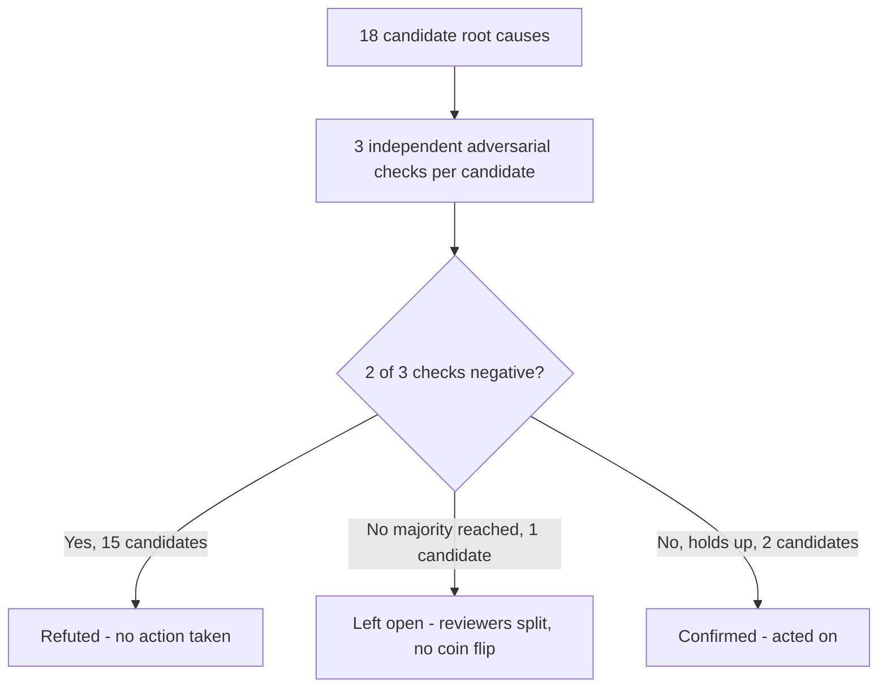

Fifteen of eighteen root causes I proposed for four firing alerts turned out to be wrong. Four alerts were going off across my home infrastructure at once: a stuck download post-processing backlog, plus three separate automation alerts tied to a video-discovery pipeline.

My first instinct on each one: form a theory fast, patch it, watch the alert clear. But I forced myself to do the opposite — generate every plausible root cause I could find, then attack each one before touching anything. Eighteen candidates went in. Three survived. **That refutation rate is the actual finding here, more than any single bug I fixed.**

## The method was adversarial verification, not more logging

Adversarial verification means treating your own hypothesis as something to disprove, not something to confirm. For each candidate root cause, I ran three independent checks against three different failure modes:

- Is the claim actually correct?
- Is there a more likely alternative explanation for the same symptom?
- Would acting on this fix cause harm even if the diagnosis were right?

Two negative checks out of three killed a finding, and I moved on without touching code.

I used parallel background agents to run these checks concurrently, one per lens, working off the same evidence but arguing independently — the same independence-over-agreement bet behind [the dueling-agent review design I sketched elsewhere](/blog/dueling-agent-orchestration-suites/). The mechanism doesn't matter much: you could run this with three colleagues, or with yourself on three separate days.

**What matters is that confirmation and refutation are different jobs.** Doing both with the same brain in the same sitting is how bad root causes survive into production.

Here's how the 18 candidates actually funneled down:

The whole investigation stayed read-only until every surviving finding cleared verification:

- No config edits
- No restarts
- No "let me just try this" during the diagnostic pass

That discipline is what made the refuted list trustworthy — I never contaminated a measurement by fixing something mid-investigation.

## A refuted finding: zero didn't mean what I thought it meant

Earlier in this same session, before I tightened up the process, I had already reported that a download client's bandwidth was pinned at 0 B/s and blamed an empty configuration value colliding with a governor script that writes percentage-based limits. That looked like an obvious bug. It would have been an easy one-line fix: set the missing value.

It was wrong, and setting that value would have made things actively worse. I traced the actual code path in this download client's percentage-limit branch.

A zero limit there means unlimited, not stopped — the log line that reads like a stall is literally the client's own phrasing for "no cap applied."

I confirmed this three separate ways, including running the branch logic directly inside the container and cross-checking it against a measured throughput number that only made sense if the download was, in fact, running at full speed. Setting the value I'd flagged would have flipped the client into a different code branch entirely, one that computes a mismatched percentage on every release cycle and throws a runtime error every time.

I would have taken a healthy, fast-running download client and broken it myself, on my own advice. It's the same trust-a-single-signal failure that produced [my GPU broker's phantom-game bug](/blog/debugging-false-positive-gpu-contention-detection/): one plausible reading of one signal, promoted straight to ground truth.

## A confirmed finding: the alert metric was lying about its own units

One of the four original alerts was measuring how long the oldest item had been stuck in the post-processing queue. The number it reported never looked right — it read low even when I could see items sitting untouched for days.

The bug turned out to be in how the metric collector seeded its internal clock: it stamped each item's "first seen" time from the moment the collector itself first observed it, not from when the item actually entered the queue. Every entry read back the exact same duration, no matter how long it had really been waiting, because **the whole gauge was secretly measuring collector uptime**.

That one survived all three checks cleanly. The alternative-cause reviewer couldn't find a queue-processing explanation that fit the flat, identical readings across separate instances. The fix-safety reviewer confirmed the correct source of truth was already present in the underlying data and just needed to be read instead of guessed.

After I re-seeded the clock from the real timestamp, the two queue instances immediately started reporting different, correct numbers: one nearly four days old, the other over a day and a half. The alert had been reporting a real problem's existence without ever reporting its true severity, for as long as it had been deployed.

## A second confirmed finding was worse than the alert it was supposed to fix

A budget governor script was supposed to reduce how often a discovery pipeline fired, to stay under a resource cap. Its "reduced" setting was implemented as a scheduling override applied on top of the baseline schedule — but the override mechanism in the underlying scheduler doesn't replace an existing schedule when you add to it that way. It appends.

The lever meant to cut cadence was quietly increasing it: the "reduced" tier stacked a second firing schedule on top of the baseline instead of replacing it.

Separately, a blank scheduling directive left in one code path caused the whole timer unit to fail to load at all, silently, with no warning that it had been disabled rather than paused. Both bugs shipped together and had been live long enough that nobody would have found either by reading the code once and moving on.

## What this cost, and what it still couldn't tell me

Running eighteen hypotheses through three-lens verification is not fast. It took a long investigation session, and most of the eighteen candidates burned real analysis time before getting refuted. That's the tax you pay for not shipping a plausible-sounding fix on the first guess.

I think it was worth it here. Two of the three survivors were actively harmful if left alone, and the one I would have shipped from my earlier, faster pass would have made a healthy system fail on the next release cycle.

The process also has a real blind spot. One finding, a file-permission mismatch behind a wave of import errors, split my reviewers: one found evidence the bad files existed for hours before the failures started, another found the same failures beginning within minutes of a container restart despite those files already being in place.

Majority-refutation needs an actual majority, and a genuine split doesn't produce one. I left that finding open rather than act on a coin flip — the right call, but it means **adversarial verification didn't resolve it, it just kept me from pretending it had**.

The backlog itself is also still draining slower than it should, and I haven't traced a single item through the pipeline start to finish to prove why. Eighteen hypotheses in, some things are still genuinely unknown, and the honest move is to say so instead of closing the ticket.

The point of this exercise was never about the agents. It was about building a process where a plausible root cause has to survive someone actively trying to kill it before I'm allowed to act on it. Fifteen didn't survive. I'm glad I found out before I touched anything.
