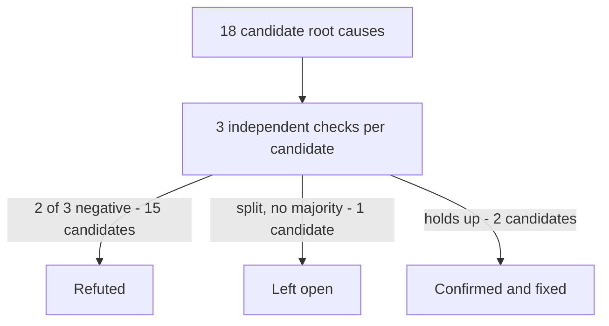

You can't trust the output of agents. I expect conflicting reports from them by default now. That's why review matters, and it's why I'm exploring pitting different agents against each other instead of taking any single one at its word. Four alerts fired across my home infrastructure at once this month, and I ran eighteen candidate root causes through adversarial verification before touching anything. Most of them didn't survive it.

The next step is still half-formed. I'm looking into using Claude for the heavy lifting alongside local LLMs I run myself, like Qwen, built by different companies in different countries. I think those two have genuinely dueling interests. They'd critique a finding in ways the other one never would. It's close to [the dueling-agent review design I sketched elsewhere](/blog/dueling-agent-orchestration-suites/), just with different model providers instead of different review lenses. I don't know yet. I'm still thinking about it.

## Running Four Alerts Through 59 Agents, Not Grinding Through Them Myself

I always try to run things as concurrently as possible to save time. I don't trust what goes into an agent any more than I trust what comes out, so instead of grinding through four alerts myself, I split the investigation into four diagnostic lanes, one per alert, and ran 59 agents across them, built to not step on each other. Then I could just review what came back.

Each candidate got three independent checks: is the claim correct, is there a more likely alternative explanation, would acting on the fix cause harm even if the diagnosis holds. Two negative checks killed a finding without me touching code.

```mermaid
flowchart TD
    A[18 candidate root causes] --> B[3 independent checks per candidate]
    B -->|2 of 3 negative - 15 candidates| C[Refuted]
    B -->|split, no majority - 1 candidate| D[Left open]
    B -->|holds up - 2 candidates| E[Confirmed and fixed]
```

Eighteen candidates went in.

Fifteen came back refuted, two got fixed, one stayed open. The fixes shipped as PR #34.

## Two Reviewers Split on the Same Files, and a Split Doesn't Resolve Itself

One of the three survivors split my reviewers right down the middle. 16,703 files owned by uid 1024, mode 0600. One reviewer found the bad files had existed for hours before the failures started. Another found the same failures beginning within minutes of a container restart, with those files already in place. Majority-refutation needs an actual majority, and a genuine split doesn't produce one, so I left it open instead of acting on a coin flip. Adversarial verification didn't resolve it. It just kept me from pretending it had.

The other two survivors were actively harmful if left alone. One was a post-processing alert that measured how long its own metric collector had been running instead of how old the stuck item was. The other was a budget governor whose "reduced" cadence setting stacked a second schedule on top of the baseline instead of replacing it. Bugs happen, and I'm not upset when they do. It's good to be able to see them, cover them with observability and monitoring and tests, so the bug catches itself the next time it pops up. Good tools get maintained over time. They aren't built in a day.

## The GPU Broker Problem I Still Haven't Fixed

The instinct behind all of this traces back to [a trust-a-single-signal mistake I made in my GPU broker](/blog/debugging-false-positive-gpu-contention-detection/), treating one signal, game detected, don't touch the GPU, as ground truth. I was never sold on the exact trigger for that mechanism. A Steam background process, a game update, or Plex briefly touching the GPU can all false-positive the same way. We're still trying to figure out how to handle different processes using the GPU briefly instead of one at a time. Right now the fix is blunt. It's all or nothing: kill or queue whatever GPU process the LLM flags. It works, but it's not elegant, and it's not really solved.

The backlog is still draining slower than it should, and I haven't traced a single item through the pipeline start to finish to prove why. I've only got so much time in a day. I should have done that already, and I'll probably get to it later. I don't like leaving things open, but you just have to use your time wisely, and that's the main thing.
