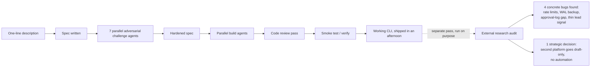

Shipping fast is not the same as being done, and I had to learn that the expensive way with a CLI tool an agent pipeline built for me in one afternoon. The pipeline is one I built myself: I give it a one-line description of what I want, it writes a spec, runs that spec through seven parallel agents whose only job is to attack it from different angles, spins up parallel build agents against the hardened spec, runs a full code review pass, then smoke-tests the real thing before calling it done. For a small outreach-automation CLI (local SQLite state, a human approval gate before anything goes out, a GitHub-facing sourcing loop), that pipeline produced working software in an afternoon. It ran. It did the job I asked for. It was also not something I trusted enough to extend to a second platform without checking it first.

## The pipeline optimizes for the spec, not for what the spec left out

Every phase in that pipeline checks the code against what I asked for. The adversarial challenge attacks the spec itself, the build agents implement against the hardened version, the review pass checks the diff for bugs and style, and the verify step proves the CLI actually runs end to end. None of that touches questions I never thought to ask in the spec. I hadn't written "honor GitHub's rate-limit contract" or "make sure the SQLite backup survives a write in progress" anywhere, so nothing in the pipeline went looking for those gaps. A spec-driven pipeline is only as complete as the spec, and mine had holes I couldn't see until something outside the pipeline pointed a light at them.

Here's the shape of both passes side by side: the build pipeline that shipped the CLI, and the separate audit pass that checked its work.

That something was a separate research pass I ran on purpose, specifically to find holes before adding a second platform. It pulled in GitHub's own API documentation, SQLite backup literature, comparable open-source tools, and, because the second platform I wanted to add was one with a strict terms-of-service posture around automation, that platform's actual user agreement. Four concrete problems came out of it, plus one decision that changed my plan for the second platform entirely.

## The GitHub loops never met GitHub's own rate-limit contract

My tool has three loops that poll and post against GitHub (sourcing, checking, and queue-draining), and none of them honored the limits GitHub documents for its own API. GitHub publishes real numbers: a cap on concurrent requests, a points-per-minute budget on REST calls, a separate and much stricter cap on content-creating requests per minute and per hour. GitHub's docs are also explicit that repeatedly ignoring rate-limit errors can get an integration banned outright, not just throttled. My loops were calling the API and hoping, with no code anywhere that read a `Retry-After` header or backed off on a 403. The fix was mechanical once I knew what to build: honor `Retry-After` and the rate-limit-reset header first, switch polling loops to conditional requests so unchanged data comes back as a cheap 304 instead of spending budget, and space out anything that creates content by at least a second. None of that is clever. All of it was missing.

## A raw file copy could have quietly corrupted the backup

The tool's entire state (accounts, drafts, leads) lives in one SQLite file, and the backup routine copied that file directly on a schedule. SQLite in its default mode buffers recent writes in a separate write-ahead log file, and a plain file copy of the main database while that log holds unflushed writes can capture a database that looks intact and isn't. This is the kind of bug that never shows up in testing, because testing doesn't usually catch a backup mid-write, and it only bites the one time you actually need the backup to be good. The fix is a single command swap, from a raw copy to a WAL-safe backup call that captures a consistent snapshot regardless of what's mid-flight. Small fix, but it was sitting on exactly the failure mode I'd never notice until it was too late to matter.

## The approval gate had no memory of its own decisions

Nothing goes out of this tool without a human approving it first, and that gate is tied to a hash of the exact content being approved, so any edit after approval voids it automatically. That part of the design held up fine under review. What was missing was history: no log of who approved what, when, or what got rejected and why. If I wanted to know later why a specific piece of content went out, or audit a month of decisions, there was nothing to check against but my own memory of pressing a key. Commercial approval-workflow tools keep exactly this kind of log by default. Mine didn't, and it's the kind of gap that's invisible right up until you need it for a reason you didn't plan for.

## Lead-sourcing ran on one thin signal

The tool finds candidates to reach out to using keyword matching against a configured niche list, and that's the whole signal. Comparable tools in this space enrich candidates with graph signals (repository stars, forks, contributor overlap) that catch relevance keyword matching alone misses. I haven't fixed this one yet. It's queued, not resolved, and I'm listing it here instead of pretending it's closed because the rest of this post is about being honest about what "done" actually took.

## Extending to a second platform meant deciding not to automate it

The most consequential finding wasn't a bug at all. Before writing a single line for the second platform, I checked its user agreement, and it explicitly bans the exact category of automation my GitHub loops already do: auto-connecting, auto-posting, auto-commenting, and scraping via any bot or script. Real ban-rate data on comparable automation tools for that platform backs the terms up. Even the more cautious, cloud-hosted versions of that kind of automation carry meaningful suspension risk. And I found at least one legitimate, adopted product in that space that does exactly what I was already leaning toward: format drafts for a human to review and post manually, no session automation at all. That's proof draft-only is a real category, not a compromise I was talking myself into. So the second-platform build changed shape entirely: instead of extending the same auto-post pattern, I'm formatting approved drafts with suggested timing for that platform's own native scheduler and stopping there.

## What I'm still not sure about

I don't know yet whether a dedicated audit pass like this needs to happen after every run of my build pipeline, or whether this project just happened to be unusual enough, real external APIs, real state that has to survive a backup, a second platform with real legal terms, to need one. Running an audit like this on every small tool I build would be pure overhead for most of them. I lean toward doing it whenever a tool talks to another service's API or holds state I'd actually miss if it corrupted, and skipping it otherwise, but I've only tested that rule on one project so far. The build pipeline did exactly what I asked it to do, fast and correctly. It just turned out that "what I asked for" and "what I actually needed before trusting this thing" were two different lists, and finding the second list took a separate pass I almost skipped.
