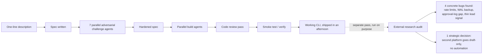

Shipping fast is not the same as being done. I learned that the expensive way, on a CLI tool my own agent pipeline built in one afternoon.

The pipeline is mine. Feed it a one-line description of what I want, and it runs a fixed sequence:

- Writes a spec
- Runs that spec through seven parallel agents whose only job is to attack it from different angles (the same independence argument behind [the dueling-agent-suites design I sketched separately](/blog/dueling-agent-orchestration-suites/))
- Spins up parallel build agents against the hardened spec
- Runs a full code review pass
- Smoke-tests the real thing before calling it done

For a small outreach-automation CLI (local SQLite state, a human approval gate before anything goes out, a GitHub-facing sourcing loop), that pipeline produced working software in an afternoon. It ran. It did the job I asked for. But it wasn't something I trusted enough to extend to a second platform without checking it first.

## The pipeline optimizes for the spec, not for what the spec left out

Every phase in that pipeline checks the code against what I asked for. But none of that touches questions I never thought to ask in the spec.

I hadn't written "honor GitHub's rate-limit contract" or "make sure the SQLite backup survives a write in progress" anywhere, so nothing in the pipeline went looking for those gaps. **A spec-driven pipeline is only as complete as the spec.**

Here's the shape of both passes, side by side: the pipeline that shipped the CLI, and the separate audit that checked its work.

That something was a separate research pass, run on purpose, to find holes before adding a second platform, since that platform carries a strict terms-of-service posture around automation. It pulled from:

- GitHub's own API documentation
- SQLite backup literature
- Comparable open-source tools
- That platform's actual user agreement

## The GitHub loops never met GitHub's own rate-limit contract

My tool has three loops that poll and post against GitHub (sourcing, checking, and queue-draining), and none of them honored the limits GitHub documents for its own API. [GitHub publishes real numbers](https://docs.github.com/en/rest/using-the-rest-api/rate-limits-for-the-rest-api):

- A cap on concurrent requests
- A points-per-minute budget on REST calls
- A separate, much stricter cap on content-creating requests per minute and per hour

GitHub's docs are explicit that repeatedly ignoring rate-limit errors can get an integration banned outright, not just throttled.

My loops were calling the API and hoping, with no code anywhere that read a `Retry-After` header or backed off on a 403.

The fix was mechanical once I knew what to build, straight from [GitHub's REST API best-practices guide](https://docs.github.com/en/rest/using-the-rest-api/best-practices-for-using-the-rest-api):

- Honor `Retry-After` and the rate-limit-reset header first
- Switch polling loops to conditional requests, so unchanged data comes back as a cheap 304 instead of spending budget
- Space out anything that creates content by at least a second

None of that is clever. All of it was missing.

## A raw file copy could have quietly corrupted the backup

The tool's entire state (accounts, drafts, leads) lives in one SQLite file, and the backup routine copied that file directly on a schedule.

SQLite in its default mode buffers recent writes in a separate **write-ahead log** file. A plain file copy of the main database while that log holds unflushed writes can capture a database that looks intact and isn't. Testing won't catch this: it only bites the one time you actually need the backup to be good.

The fix is a single command swap, from a raw copy to [SQLite's own online-backup call](https://www.sqlite.org/backup.html) that captures a consistent snapshot regardless of what's mid-flight.

Small fix. But it was sitting on exactly the failure mode I'd never notice until it was too late to matter.

## The approval gate had no memory of its own decisions

Nothing goes out of this tool without a human approving it first, and that gate is tied to a hash of the exact content being approved, so any edit after approval voids it automatically. That part of the design held up fine under review.

What was missing was history: no log of who approved what, when, or what got rejected and why. If I wanted to know later why a specific piece of content went out, or audit a month of decisions, there was nothing to check against but my own memory of pressing a key.

Commercial approval-workflow tools keep exactly this kind of log by default. Mine didn't. It's the kind of gap that's invisible right up until you need it, for a reason you never planned for.

## Lead-sourcing ran on one thin signal

The tool finds candidates to reach out to using keyword matching against a configured niche list, and that's the whole signal. Comparable tools in this space enrich candidates with graph signals (repository stars, forks, contributor overlap) that catch relevance keyword matching alone misses.

I haven't fixed this one yet. It's **queued, not resolved**, and I'm listing it here instead of pretending it's closed because the rest of this post is about being honest about what "done" actually took.

## Extending to a second platform meant deciding not to automate it

The most consequential finding wasn't a bug at all. Before writing a single line for the second platform, I checked its user agreement. It explicitly bans the exact category of automation my GitHub loops already do:

- Auto-connecting
- Auto-posting
- Auto-commenting
- Scraping via any bot or script

Real ban-rate data on comparable automation tools for that platform backs the terms up. Even the more cautious, cloud-hosted versions of that kind of automation carry meaningful suspension risk.

But I also found at least one legitimate, adopted product in that space doing exactly what I was already leaning toward: format drafts for a human to review and post manually, no session automation at all. **That's proof draft-only is a real category, not a compromise I was talking myself into.**

So the second-platform build changed shape entirely. Instead of extending the same auto-post pattern, I'm formatting approved drafts with suggested timing for that platform's own native scheduler, and stopping there.

## What I'm still not sure about

I don't know yet whether a dedicated audit pass like this needs to happen after every run of my build pipeline, or whether this project just happened to be unusual enough (real external APIs, real state that has to survive a backup, a second platform with real legal terms) to need one. Running an audit like this on every small tool I build would be pure overhead for most of them.

I lean toward doing it whenever a tool talks to another service's API or holds state I'd actually miss if it corrupted, and skipping it otherwise. But I've only tested that rule on one project so far.

The build pipeline did exactly what I asked it to do, fast and correctly. **"What I asked for" and "what I actually needed before trusting this thing" turned out to be two different lists.**

The second one had a write-ahead log and a rate-limit header on it that the spec never mentioned — finding it took a separate pass I almost skipped.
