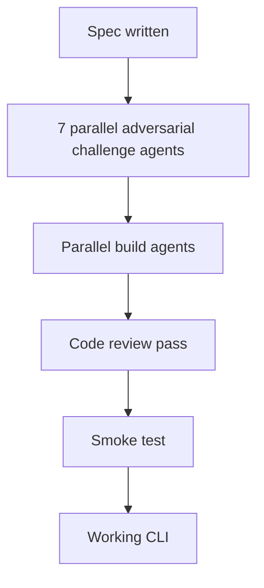

I don't trust my agent pipeline, and I'm not going to. My gut says every agent pipeline run needs an audit pass, as close to every time as I can manage, because nothing that comes out of one is ever perfect. Run it for a while first and you can pull real data on how it's been doing, and that's when you get data-based ideas about where to focus the refinement instead of guessing.

The pipeline runs a fixed sequence: write a spec, run it through seven parallel agents that attack it from different angles (the same independence argument behind [the dueling-agent-suites design I sketched separately](/blog/dueling-agent-orchestration-suites/)), spin up parallel build agents against the hardened spec, run a code review pass, then smoke-test the result.

```mermaid
flowchart TD
    A[Spec written] --> B[7 parallel adversarial challenge agents]
    B --> C[Parallel build agents]
    C --> D[Code review pass]
    D --> E[Smoke test]
    E --> F[Working CLI]
```

Fed a one-line description of a small outreach-automation CLI (local SQLite state, a human approval gate, a GitHub-facing sourcing loop), it produced working software in an afternoon. It ran. It did the job I asked for.

## The Pipeline Only Catches What The Spec Asked For

I almost skipped the separate audit that found what was wrong with it. This was earlier in my process of using agents, back when I was still getting familiar with their limits, and I'd been prioritizing moving fast over moving accurately. That instinct is what almost talked me out of a separate check. But every phase in that pipeline only checks the code against what I asked for in the spec — none of it goes looking for a question I never thought to write down in the first place.

## Four Gaps A Spec-Driven Build Never Flags

The audit found four of them. Three loops calling [GitHub's rate-limit rules](https://docs.github.com/en/rest/using-the-rest-api/rate-limits-for-the-rest-api) with no code that read a `Retry-After` header or backed off on a 403, against a service that documents an outright ban as the risk for ignoring those limits repeatedly. A backup routine that copied the SQLite file directly, while [SQLite's own backup documentation](https://www.sqlite.org/backup.html) warns that its default mode buffers recent writes in a separate write-ahead log. A plain copy mid-flush can capture a database that looks fine and isn't. An approval gate that correctly voided itself on any edit after sign-off, but kept no log of who approved what or when. And a lead-sourcing loop running on keyword matching against a configured list, nothing else checking relevance the way graph signals like stars, forks, or contributor overlap would.

I haven't fixed that last one yet. Everything's on the list for later. I just don't know the order of what I should be looking at and when.

## Banning The Whole Automation Category Punishes The Wrong People

Extending the tool to a second platform meant checking its user agreement first, and it explicitly bans the whole category of automation my GitHub loops already do: auto-connecting, auto-posting, auto-commenting, scraping by any bot or script.

I think that whole automation category is valuable — the efficiency, the deterministic repeatability of it. Platforms that ban it outright kill everything to stop bad actors instead of targeting them specifically, and that punishes everyone else who just wants the efficiency. I'm a hacker, and I'm all about the free spirit hacker culture that's supposed to sit at the center of being a good programmer.

So the second-platform build changed shape entirely. At least one legitimate product in that space already does exactly what I pivoted to: drafts for a human to review and post manually, no session automation at all. Instead of extending the same auto-post pattern, this one formats approved drafts with suggested timing for that platform's own scheduler, and stops there.

## I'm Not Done Trusting It

What I ask for is never going to be exactly what I get. It's always been an imperfect process. My job is to keep checking it, cutting out as much of the manual work as I can.

That's the goal.

But I still need to be the "ghost in the machine."
