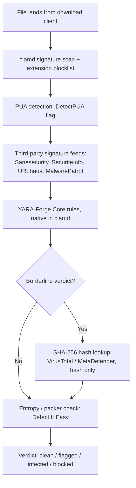

A clean ClamAV scan means nothing matched a known signature. It does not mean the file is safe. I run a scan gate in front of my media-download pipeline: everything that lands from the download clients gets checked by a ClamAV daemon before it's allowed into the library. (The pipeline sits on the placement split from [Not every Docker container belongs on the NAS](/blog/not-every-docker-container-belongs-on-the-nas/).) For a long time I treated a clean verdict as the end of the question. But it isn't. ClamAV is a signature engine, and signature engines only catch what someone has already seen, fingerprinted, and shipped a rule for. Zero-days and packed or obfuscated executables walk right past it. Worse: ClamAV is open source, so anyone can download the exact detection logic and test their malware against it before release. Free QA for the bad guys. That's not a hypothetical — researchers have measured samples built specifically to dodge open-source detectors evading ClamAV on the order of 70 to 85 percent of the time, without even needing inside knowledge of the engine.

Here's the full layered gate, in the order a file actually passes through it:

## Signature scanning only catches what's already been seen

Every ClamAV signature exists because someone already found and analyzed that malware sample. A brand-new keygen or crack, repacked or lightly modified, has no signature yet, and it sails through clean. Packed and obfuscated binaries make this worse: the payload is scrambled until runtime, so a static signature scanner has nothing to match against, even for a known threat. My original scan gate had one static layer: clamd plus a blocklist on file extensions like `.exe`, `.scr`, `.bat`, and a handful of others. That layer stops the laziest attacks and nothing else. But the real threat model for a media pipeline isn't a nation-state implant. It's commodity crack and keygen malware bundled into an executable that a downloader was told to run — exactly the category built to slip past exactly this kind of scanner.

## PUA detection targets the actual threat, with a real tradeoff

ClamAV has a flag, [`DetectPUA`](https://docs.clamav.net/faq/faq-pua.html), that flags potentially unwanted applications: adware, riskware, and, most relevant here, keygens and cracks. Turning it on is a one-line config change to `clamd.conf` — no code touched. But it's not a free lunch. PUA signatures are less rigorously curated than core malware signatures, so expect more false positives on legitimate but aggressively-bundled installers. ClamAV's own category-exclusion filtering for PUA is currently broken in the shipped version I'm running, so I can't cleanly say "flag keygens but ignore adware" and trust the exclusion list to hold. I'm turning it on anyway, tuning against real false positives as they show up, because the alternative is leaving the single most on-target detection knob switched off.

## Third-party signature feeds close known gaps for free

ClamAV's own database misses a lot that other groups have already catalogued. [`clamav-unofficial-sigs`](https://github.com/extremeshok/clamav-unofficial-sigs) is a maintained aggregator that pulls in [Sanesecurity](https://sanesecurity.com/), SecuriteInfo, [URLhaus](https://urlhaus.abuse.ch/), and MalwarePatrol feeds, and drops them straight into the same database directory clamd already reads. No changes to my scan gate's code. No new dependency in the pipeline logic. Just a cron job and a shared volume. Of everything I added, this is the best ratio of detection gained to effort spent, because it's pure config and it widens the signature set clamd already checks against on every scan.

## YARA rules run inside clamd, but only the trimmed kind

Clamd loads `.yar` files natively from the same database directory, no separate engine required, and applies YARA rules against files it has already unpacked from archives and installers. That's a real advantage over running YARA standalone, since clamd's decomposition sees inside the containers a raw file scan would miss. But clamd's YARA support is only a subset of full YARA: no imports, no external variables, a 64-string cap per rule, minimum two-byte string segments. Community rule packs written for full YARA often won't load as-is. I'm using [YARA-Forge's curated "Core" tier](https://github.com/YARAHQ/yara-forge) instead of pulling raw rules from wherever, because unvetted community rules have a documented history of tanking scan performance — one bad rule reportedly took a three-hour scan job to seven. Curation here isn't optional polish. It's the difference between a scan gate that finishes and one that doesn't.

## A hash lookup adds a second opinion without uploading anything

Signature and YARA scans both run locally against files I already have. A hash lookup asks a different question: has anyone else already seen this exact file and scored it? I compute a SHA-256 of anything the local scan flags as borderline and check it against VirusTotal's or MetaDefender's free tier — hash only, never the file itself. That distinction matters for a pipeline that occasionally handles cracked software. Uploading the actual file to a public multi-scanner makes it permanently visible and searchable by anyone, which is exactly the kind of exposure I don't want for downloads that were never meant to be public. This isn't shipped in my scan gate's code yet. It needs a new verdict state that plugs into the same aggregation logic the gate already uses, so a "flagged, pending second opinion" result sits in the same priority chain as infected, blocked, and clean.

## Entropy and packer detection catch what hashes can't

A hash lookup only works if someone else has already seen the file. A packer or entropy check doesn't need that. [Detect It Easy](https://github.com/horsicq/Detect-It-Easy), and its CLI `diec`, identifies packers and protectors on executables and reports Shannon entropy. A section reading above roughly 7 bits of entropy is the standard first signal that it's packed or encrypted rather than plain code. This is a heuristic, not a verdict. I plan to route it to quarantine-and-alert rather than a silent auto-block, because plenty of legitimate installers are also highly compressed, and I don't want to nuke a real release over a false positive I can't explain later.

## What I'm deliberately not building

A self-hosted dynamic-analysis sandbox, actually detonating suspicious files in an isolated VM to watch what they do, is technically doable in a home lab. [CAPEv2](https://github.com/kevoreilly/CAPEv2) runs fine on a single box with nested virtualization. But I'm not building it. It's a heavyweight answer to a threat model that's mostly commodity keygen and crack malware, not a targeted attacker who needs behavioral analysis to unmask. If one of the layers above misses something in an actual incident, that's the trigger to revisit sandboxing. Building it preemptively against a threat that doesn't need it is effort spent on the wrong risk.

## The honest residual gap

None of this closes the gap completely, and I don't think any config change could. A sufficiently novel packer that mimics legitimate compression entropy, paired with a payload built against ClamAV's public signature set and PUA rules specifically, can still get through every layer I've described. The hash lookup only helps once a file is already known to someone — a first-seen sample gets a pass there by definition. What changed isn't that my scan gate is now airtight. It's that I stopped treating a clean verdict as proof of safety, and started treating it as one data point among several, none of which is trustworthy alone. That's a more honest place to operate from, even if it's a less comfortable one.
