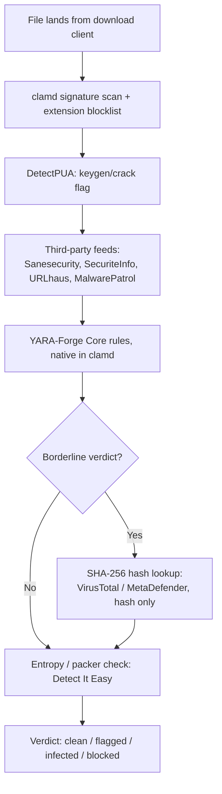

A clean ClamAV scan is one of the mini indicators something's wrong or off, not proof. I don't trust much to stay secure for long: things change too fast, and there are too many vectors to attack a system. The gate in front of my media-download pipeline runs a file through five more checks past ClamAV's own signature match.

Everything that lands from the download clients gets checked before it's allowed into the library. (The pipeline sits on the placement split from [Not every Docker container belongs on the NAS](/blog/not-every-docker-container-belongs-on-the-nas/).) The sequence:

```mermaid
flowchart TD
    A[File lands from download client] --> B[clamd signature scan + extension blocklist]
    B --> C[DetectPUA: keygen/crack flag]
    C --> D["Third-party feeds:<br/>Sanesecurity, SecuriteInfo, URLhaus, MalwarePatrol"]
    D --> E[YARA-Forge Core rules, native in clamd]
    E --> F{Borderline verdict?}
    F -->|Yes| G["SHA-256 hash lookup:<br/>VirusTotal / MetaDefender, hash only"]
    F -->|No| H[Entropy / packer check: Detect It Easy]
    G --> H
    H --> I[Verdict: clean / flagged / infected / blocked]
```

## Signature scanning only catches malware someone's already found

Every ClamAV signature exists because someone already found and analyzed that sample. A new keygen or crack has no signature yet and sails through clean; packed binaries are worse, since the payload's scrambled until runtime. ClamAV is open source, so anyone can test malware against the exact detection logic before release, no inside knowledge required.

My original gate was one layer: clamd plus a blocklist on extensions like `.exe`, `.scr`, `.bat`. The real threat is commodity crack and keygen malware bundled into an executable a downloader was told to run, exactly what this scanner is built to miss.

## Turning on PUA detection hasn't bitten me yet

ClamAV has a [`DetectPUA`](https://docs.clamav.net/faq/faq-pua.html) flag for potentially unwanted applications: adware, riskware, keygens, cracks, available via `clamd.conf`. PUA signatures are less rigorously curated than core malware ones, so more false positives are expected, and category-exclusion filtering (flagging keygens without adware) is broken in my version.

I turned it on anyway.

So far, nobody's been annoyed. Still hypothetical, as far as I know.

## The third-party feeds were the one decision backed by real research

[`clamav-unofficial-sigs`](https://github.com/extremeshok/clamav-unofficial-sigs) pulls in four more feeds, [Sanesecurity](https://sanesecurity.com/), SecuriteInfo, [URLhaus](https://urlhaus.abuse.ch/), and MalwarePatrol, into the same database directory clamd already reads. No code changes to the gate, just a cron job and a shared volume. Of everything I added, this is the best ratio of detection gained to effort spent, and the one backed by real research instead of a guess. The research tried to be thorough and current, but it might be outdated by now, which is just how security goes. Still a good way to stay current, and sources I trust.

## YARA rules run inside clamd, but only a trimmed subset

Clamd loads `.yar` files natively and scans files it's already unpacked from archives and installers, an advantage standalone YARA doesn't have. Its support is only a subset though: no imports, no external variables, a 64-string cap per rule, minimum two-byte strings.

I use [YARA-Forge](https://github.com/YARAHQ/yara-forge)'s curated "Core" tier over raw community rules. One bad rule reportedly took a three-hour scan job to seven.

## The hash lookup is deliberately not built yet

A hash lookup asks a different question than signatures or YARA: has anyone else already seen this file and scored it? It computes a SHA-256 of anything flagged as borderline and checks it against VirusTotal's or MetaDefender's free tier, hash only: uploading the actual file would make it permanently visible and searchable.

It's not shipped yet. I put it aside for now. I actually would like to build it and see where it goes. Maybe that's its own post.

## Entropy checks catch what hashes and signatures both miss

A hash lookup only works once someone else has scored the file. [Detect It Easy](https://github.com/horsicq/Detect-It-Easy) identifies packers and reports Shannon entropy; a reading above roughly 7 bits signals packed or encrypted code. It's a heuristic, so it routes to quarantine-and-alert instead of an auto-block: plenty of legitimate installers are also highly compressed.

## I don't know if the sandbox call has ever been tested

A self-hosted sandbox like [CAPEv2](https://github.com/kevoreilly/CAPEv2) (detonating a file in an isolated VM to watch what it does) is doable on a single box with nested virtualization, but I'm not building it. It's a heavyweight answer for a threat model that's mostly commodity keygen and crack malware rather than a targeted attacker needing behavioral analysis to unmask.

I don't know if anything's come close to needing it. Nothing has, as far as I know, but that doesn't mean it hasn't happened. Probably a good time to go back and check.

## Security is priority one; a clean scan is just one of the mini indicators

A clean scan is one of the mini indicators that something's wrong or off. I always need more than that. Really it's a trade-off between plugging every hole and staying as current as you can be, and there's only so much compute and only so much of my own time to spend making sure things are safe. Analysis paralysis is a real thing. That said, security is priority one for anything I do.
