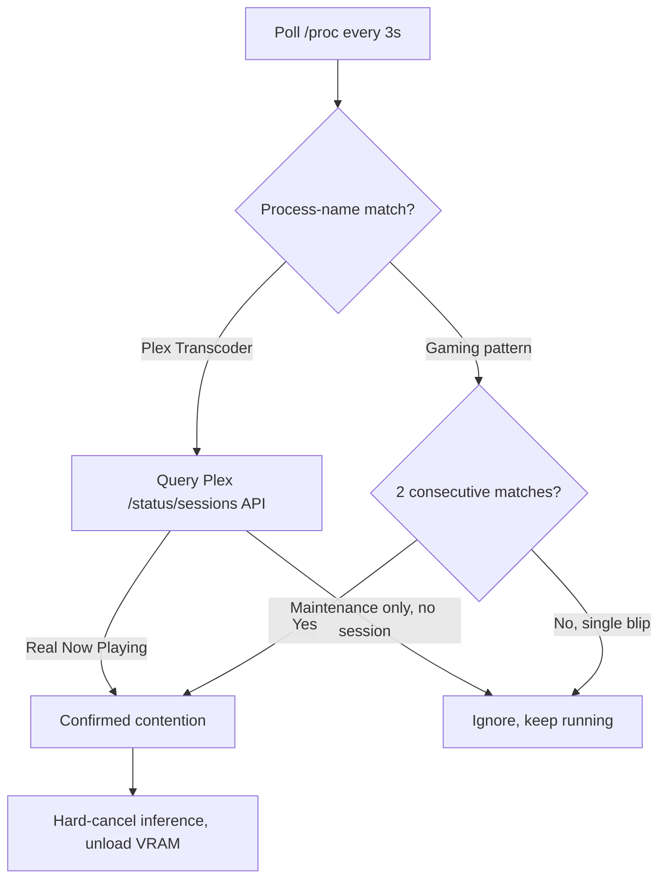

The debounce and Plex session-API fix for my GPU broker's false-positive contention bug is still in place and still working. What I want now is to push it further: use the GPU more efficiently and let more of what wants it run concurrently, instead of always handing the whole card to whichever gaming or Plex process shows up.

## Two Different Bugs Were Causing the Same Failure

The broker is a Go service I run at home, arbitrating my desktop's one GPU between gaming, Plex transcoding, and [Ollama](https://ollama.com/) inference; it later grew [a parking layer for embedding requests caught mid-yield](/blog/surviving-a-gpu-yield-window-embedding-servers/), too. Detection used to poll `/proc` every three seconds for process-name matches: `Plex Transcoder`, Steam's launch marker, Heroic's and Lutris's runner patterns, a bare `wine .exe`. One matching poll was enough: it canceled whatever inference job was running and unloaded the model from VRAM. No debounce, no second signal, one sample as ground truth.

[Plex's own support docs](https://support.plex.tv/articles/credits-detection/) confirm its transcoder binary runs background maintenance (Skip Intro, Credits detection, chapter thumbnails, loudness analysis) on a server-scheduled cadence, completely independent of anyone watching something, and a bare process match couldn't tell that apart from real playback. Gaming launchers threw a different kind of false positive: three-to-six-second process-match blips from background housekeeping, not sustained play.

That's just how it is when you're building stuff. Devils in the details.

## The Fix Asks Plex Directly and Debounces Everything Else

The Plex fix stops grepping for the process and asks Plex directly: it now queries its `/status/sessions` API, scoped to real "Now Playing" activity the way [Tautulli's session-based detection](https://github.com/Tautulli/Tautulli) already does, and it still fails toward yielding on any API error. The gaming fix is a debounce (`BROKER_YIELD_CONFIRM_POLLS`, default two consecutive same-reason detections before entering yield), while clearing contention stays instant and undebounced, since recovery only ever helps inference and never risks starving a real game. Both landed August 2nd and are accepted and implemented as ADR-0012.

Each poll now runs through this path before anything gets canceled:

## The Poll Count Was Right, New Edge Cases Weren't

The confirmation count itself was right: two polls filtered what needed filtering. What kept happening instead were new edge cases surfacing later, avenging themselves after some different combination of events I hadn't planned for. It's a pretty normal pattern when you build something and then use it: edge cases show up that you didn't plan for, which is why observability and monitoring matter so much when you're building anything.

## The Hard-Cancel Policy Still Bugs Me

The hard-cancel policy is still a little annoying, honestly. I'd rather the process on the GPU could put itself into a place where it pauses its work, so I could just pick it back up instead of losing whatever it had been doing. I really don't like losing that work. But keeping it simple until you've figured out the better version is a good way to do things, so that's the tradeoff I'm living with for now.

## What Started This: A Different Crash Entirely

All of this started because of [a LightRAG bulk-ingest job that kept crashing with a read error on its Ollama calls, cascading into a full pipeline halt](/blog/nine-fixes-lightrag-embedding-crash-one-afternoon/). Tracing that crash back to the broker's false-positive yields was a little annoying. I didn't really want to work on it. But that's how it goes: when something like that turns up, you handle it in the moment if you can, or you document it so you can handle it later. It's all just iterative.
