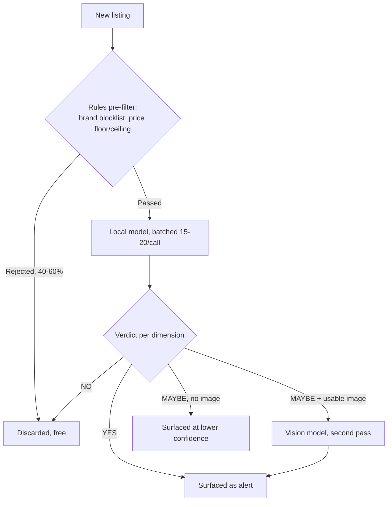

My resale-clothing monitor's hardest problem isn't finding new listings. It's deciding which ones match my taste well enough to interrupt me about, and the design leans hard toward false positives over false negatives in a way I can defend today but haven't stress-tested. This is part 3 of a series; [part 1](/blog/scrape-score-alert-resale-hunting-pipelines-local-vision-models/) covers the shared architecture, and [part 2](/blog/deciding-whats-worth-a-saturday-estate-sale-scanner/) covers a sibling project, an estate-sale scanner, that runs on the same foundation.

## A free rules layer rejects most listings before any model sees them

The monitor watches several secondhand clothing marketplaces. Its pre-filter is a set of deterministic rules that runs before any model call: a fast-fashion brand blocklist, a per-brand minimum plausible price (a "designer" item priced far below that floor is usually a knockoff), and a price ceiling by category. Together those three rules eliminate roughly 40 to 60 percent of raw listings for free.

Size is never a hard-reject rule, and that's deliberate. Sizing across resale platforms is too unreliable to gate on mechanically. Brands run differently, cuts vary, sellers mislabel. Instead of a brittle "reject anything not size L" rule, the raw size text and any stated measurements get passed to the model as a soft signal, with instructions that measurements in the description always override the label.

## Scoring is two passes, and only the ambiguous cases get the expensive one

Every new listing (title, brand, a truncated description, price, condition, size) goes through a local model first, batched 15 to 20 listings per call. That range matters: fewer wastes the fixed cost of the system prompt, and past roughly 30 the model's attention starts to degrade. The model returns a verdict, YES, MAYBE, or NO, broken into three independent dimensions (quality, value, aesthetic) plus a separate size read.

Only listings that come back MAYBE and have a usable image go to a second pass with a vision-capable model. A MAYBE with no resolvable image just stays a MAYBE and still gets surfaced, at lower confidence, rather than getting silently dropped. A parse error or malformed model output defaults the same way.

The provider for each pass, local, cloud, or a hybrid, sits behind one interface, so which backend actually runs a given scoring pass is a config change, not a code change. Once a listing has a real score, it's never re-scored. That alone is the single biggest cost reduction in the pipeline, ahead of anything model-related.

Here's the scoring pipeline a listing actually moves through:

## The bias toward false positives has no counterweight yet

Missing a genuinely good item is worse than one extra alert I dismiss in two seconds, and for a system with one user and nothing riding on a bad alert, I still think that's the right call. What it doesn't do is push back against alert volume creeping up as more edge cases land in MAYBE instead of NO over time. Nothing in the current design notices that drift or corrects for it. If this ever had to serve more than one household, that gap would be the first thing I'd have to actually solve instead of shrug at.

## Feedback splits into two tiers with different lifespans

Every run, the system prompt gets appended with a rotating set of my most recent thumbs-up and thumbs-down reactions to past alerts. The effect is staged: under 10 feedback events, nothing measurable; 10 to 25, a noticeable improvement; 25 to 50, strong calibration. Past 50, the oldest examples age out in favor of recent ones.

Separately, I can hand-write known-good and known-bad example items directly into config. Those never rotate out, and exist so the system has some ground truth before a single real alert has fired.

## One migration broke three things at once, silently

The one incident I'd flag hardest here broke silently across three places at once instead of one. The monitor's alerts and feedback originally rode the same channel: a chat bot where a thumbs-up or thumbs-down tap wrote straight back to the feedback table, no extra infrastructure needed. When the design changed to stop depending on that bot's webhook, the alert transport got swapped to a self-hosted push service in one large change. The feedback-ingestion path got gutted down to a disabled stub with no replacement wired up yet, while the docs of record still described the old bot. For a stretch, the code, the deployment config, and the docs each told a different story about how alerts and feedback worked, and the system's only learning mechanism sat fully severed with no error to say so. The fix restored feedback through a proper API endpoint on the dashboard instead of a chat bot's callback.

## Where both projects' open questions actually meet

Both this project's MAYBE-drift and the estate scanner's cascade-complexity doubt (in [part 2](/blog/deciding-whats-worth-a-saturday-estate-sale-scanner/)) share a shape I didn't notice until writing all three of these posts back to back. Every incident across both systems announced itself eventually, through a dashboard that looked stale or a log that looked suspiciously clean. Neither open question has that kind of tell. Alert volume creeping up over months as more edge cases land in MAYBE instead of NO, or a feedback loop gradually reinforcing a preference I don't actually hold anymore, wouldn't announce itself at all. Nothing in either system watches for drift like that. I'd have to notice it myself, on some Saturday, looking at a list that feels a little worse than it used to for reasons I can't immediately name. I haven't built anything that would catch it sooner than that, and I don't have a good reason why not beyond not having hit it yet.
