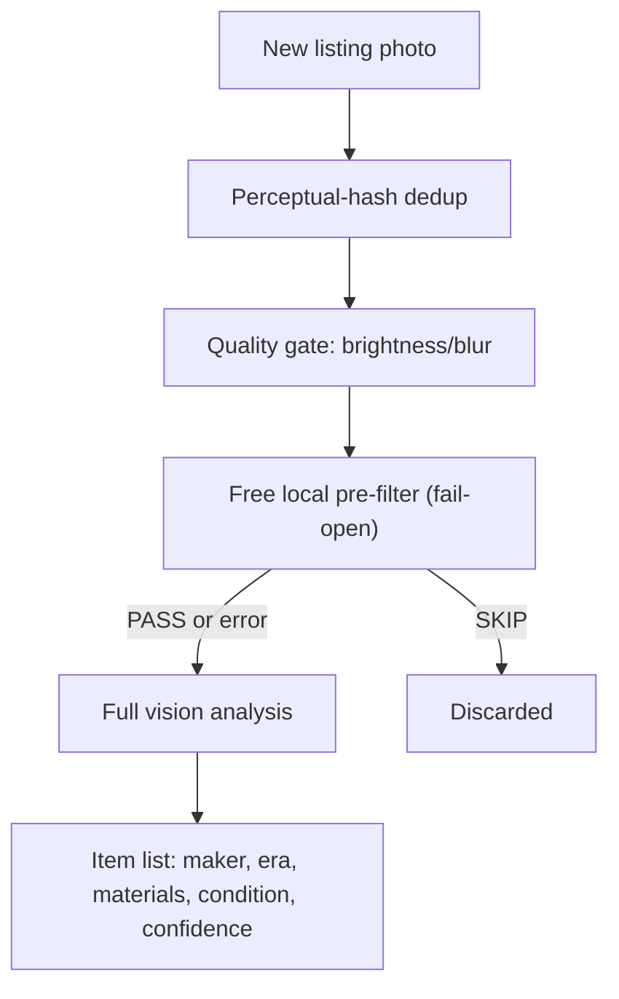

My estate-sale scanner's real job is deciding which of a week's new listings are worth a Saturday drive, and the interesting part isn't the scraping. It's how the system scores unlabeled photos, and an asymmetric feedback loop that treats a bad sale and a good sale as very different kinds of evidence. This is part 2 of a series; [part 1](/blog/scrape-score-alert-resale-hunting-pipelines-local-vision-models/) covers the shared architecture and GPU constraints behind this and a second project.

## Every photo runs through four cheap gates before any paid model call

The scanner pulls new listings from a regional aggregator once a week, then runs each photo through a pipeline in order:

1. **Perceptual-hash dedup.** Catches the same photo re-uploaded across listings.
2. **A quality gate.** Brightness and blur checks, cheap and CPU-only, drop photos too dark or blurry to read.
3. **A free local pre-filter.** A small local [Ollama](https://ollama.com/) call answers PASS or SKIP on things like empty rooms, driveways, or cardboard boxes, before any money gets spent on a stronger model. It's fail-open: if the model call errors, the photo passes through anyway. An outage never suppresses a real find. It just costs more that week.
4. **Full vision analysis.** Either a local Ollama model or, for volume, a hosted GPU endpoint running a larger vision-language model.

Here's that pipeline as an actual flow:



The model gets told what I collect: quality furniture and antiques, kitsch and camp collectibles, vintage electronics. It lists each item with a maker guess, era, materials, condition, and a confidence tag:

```text
Danish teak side table, likely 1960s, veneer chip on one corner [high]
Chalkware TV lamp, mid-century, black light wear on base [medium]
NOTHING
```

Plain text, not JSON. An internal comparison found the plain-text format caught meaningfully more real items than forcing the same model into strict JSON output. Worth knowing before you assume structured output is free.

## Two separate scores exist because they answer two separate questions

One score decides whether the rest of a sale's photos are worth analyzing at all. Process the first quarter of a sale's photos; if they come back strong, run the rest; if they come back empty, spot-check a handful from later in the listing before giving up on the sale entirely. That's pure cost control. It decides how many model calls a sale gets, not whether any single item is good.

A second, separate score, built from a curated brand list, era keywords, and the model's own confidence tag, is what the dashboard actually sorts by. The budget heuristic optimizes for not wasting calls on a dead sale. The display score optimizes for what to look at first. Conflating the two would have made cheap sales look worse than they are.

## A "waste" outcome teaches the system more than a "good" one does

After visiting a sale, I log an outcome: good, meh, or waste. That single decision, what to do with each label, is the anti-overfit design in this whole project, and it's deliberately lopsided.

A "waste" outcome propagates in bulk. Every photo from that sale becomes a confirmed-negative training example, because "the whole sale was junk" is a clean, complete signal. A "good" outcome does not auto-label every photo in the sale as good. It only proves something there was worth it, not which item. Auto-labeling the whole sale would teach a future ranker that the box of tube socks next to the good chair was also desirable. Positive labels only get created when I tap the specific item that earned the trip. It's slower to build a clean positive set this way, but a small, correct one beats a large, contradictory one.

There's also a real ground-truth run behind the scenes. Occasionally I run every surviving photo from a batch of sales through the strongest model available, no sampling, no budget limit, and treat that as the reference answer. Comparing a cheaper run's recall against that reference is how I picked a monthly spend target instead of guessing at one.

## The tiered cascade's complexity is the part I'm least sure about

The reference-pass math tells me the cheap tiers catch most of what the expensive tier would have found, which is the number I actually wanted. It doesn't tell me whether a dumber two-tier version, a quality gate plus one model call, would have caught nearly as much for a lot less engineering. I never built that version to find out. The tiered design looks rigorous because I can point at a recall number that justifies it, and I'd be lying if I said that number wasn't also the thing that let me stop second-guessing myself and ship it.

## Three failures that never threw an error

Every incident here shares one shape: nothing crashed, nothing logged an error, and the system kept looking healthy from the outside while quietly doing the wrong thing.

The free pre-filter asks a model to answer with exactly one word, PASS or SKIP, within a small token budget. The model in use is reasoning-tuned. It spends part of that budget thinking before it answers, and at the original budget it never got past its own reasoning. Every single call came back with an empty response. Because the fail-open logic treats anything that isn't literally SKIP as a pass, the gate silently passed everything, every time, for an unknown stretch. Fixed by raising the token budget and telling the model explicitly to skip its reasoning step. It's now the first thing checked whenever this project swaps in a new model.

Worse, a run could fail completely and still report success. Per-image failures were counted internally but never surfaced anywhere or reflected in the run's exit status. A week where every single paid vision call failed still logged "scan complete, 0 findings" and exited clean, indistinguishable from a genuinely quiet week, despite real money spent on every failed call. The fix split "found nothing" into three honest, differently-alarmed outcomes: genuinely nothing found, the source site's page structure likely changed, or the vision backend failed enough calls that the count can't be trusted.

For a period, the scan ran on one machine and served the dashboard from a different one, each with its own separate copy of the same SQLite file. The dashboard was quietly showing stale results relative to what the last real scan had actually found, with nothing anywhere to flag that the two had diverged. Fixed by consolidating both onto a single always-on host. The kind of bug that's obvious in hindsight and invisible while it's happening.

I don't have a general fix for this class of bug beyond looking harder at exactly the places I'm most tempted to assume are fine, and I'm not confident I've caught the last one.

[Part 3](/blog/deciding-what-fits-resale-clothing-monitor/) covers the resale-clothing monitor, its own scoring problem, and where the two projects' open questions actually converge.
