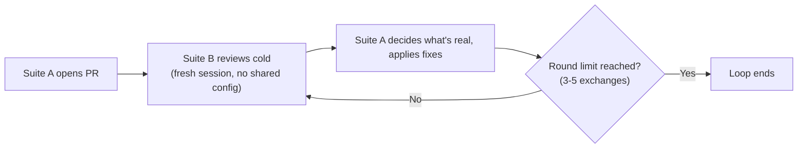

The idea is this: run two coding-agent orchestration suites that share none of the same prompts, config, or instruction derivation, and make them review each other's pull requests the way two engineers with different judgment catch each other's mistakes. Suite A opens a PR. Then suite B, built from scratch with no visibility into how A was built, reviews it cold. Suite A reads the review, decides what's real, and applies fixes. The loop can repeat from there. I thought of this on my own, then went and checked whether it already existed somewhere, because that's usually the fastest way to find out if an idea is obvious or overlooked.

## A single agent reviewing its own PR doesn't catch much

A single agent reviewing its own pull request doesn't catch much, and there's a number behind that claim now. [CodeRabbit, a production code-review tool, cites a study](https://www.coderabbit.ai/blog/code-review-needs-independence) putting the average failure rate at 64.5 percent when models are asked to correct errors they produced themselves, and names the underlying pattern the "Homogenization Trap": models trained on overlapping data share the same blind spots, so asking one model to grade its own work just replays the assumptions that produced the bug in the first place. That's the whole justification for splitting author and reviewer into separate agents. It's also why splitting them into two copies of the same model barely helps. I've watched the same blind spot from the other side already: [a separate audit pass on a CLI my own agent pipeline built](/blog/auditing-what-an-agent-pipeline-shipped-in-an-afternoon/) found four real gaps that the pipeline's built-in review never flagged, because the review only checked the code against the spec that shared its assumptions.

## The design: independent suites, not two calls to the same agent

The design only works if the two suites are actually independent, not just two separate agent invocations. Suite A and suite B need different base models, or at minimum instruction sets and personas derived without either side looking at the other's files, the same way two engineers who never compared notes would naturally write different code for the same ticket. When B reviews A's PR, it should start from a fresh session rather than carry context across review rounds, because letting a reviewer agent hold onto its own earlier verdict is a known way for it to anchor on that verdict instead of looking again. And the loop needs a hard round limit, somewhere around three to five exchanges, so the respond-and-re-review cycle can't spin forever on a disagreement neither side will drop.

Here's the loop itself:

## Nobody ships this as a preset, but the pieces exist

Nobody ships this exact pattern as a ready preset, but the pieces are scattered across current tools and papers. Academic research on adversarial debate between large language models already studies quality gains when review peers are genuinely different rather than cooperative copies of each other, and at least one recent paper formalizes almost the same author-reviewer-critic loop I sketched, adding a third agent that audits the reviewer's own review. [Qodo's second-generation review tool](https://www.qodo.ai/blog/introducing-qodo-2-0-agentic-code-review/) runs several specialized agents in parallel against one PR and posted the best F1 score, a standard accuracy measure combining precision and recall, of eight review tools tested, though that's parallel specialist review rather than an adversarial author-versus-reviewer duel. Mainstream orchestration frameworks ship a generic writer/reviewer role you can wire up yourself, but none of them package "two independently-derived agent suites duel it out" as something you install and configure. That gap is the actual whitespace here. The concept is already well studied; what's missing is a packaged version of it.

## The market's clearest independent reviewer just lost its independence

The strongest counter-signal I found points the other way. Cursor, one of the more popular AI coding tools, [acquired Graphite in December 2025](https://graphite.com/blog/graphite-joins-cursor), with a stated plan to combine Graphite's Diamond reviewer with Cursor's own Bugbot, so the most notable separate-company code reviewer on the market is now owned by the same vendor that ships the authoring agent. If the industry keeps consolidating that way, buying genuine cross-vendor independence gets harder every year rather than easier, and a dueling-suite design that leans on "different vendor, different training run" as its independence guarantee is betting against that trend.

## This is a design sketch, not something running

I want to be honest about where this stands. This is a design sketch pulled together from research, not a system I've built or run. I don't have a working prototype, I don't have latency or cost numbers from my own attempts, and everything above about round limits and fresh sessions is a plan rather than a measurement. One source did report real numbers from someone else's cross-model adversarial review setup. Each review pass took 30 to 90 seconds. A full exchange ran three to five debate rounds with two separate models in play the entire time. Multiply that across a normal-sized PR and the wait before a suite even finishes disagreeing with itself starts to look expensive for something that might just find the same handful of issues a single well-configured reviewer agent would have caught in one pass.

## The real question is whether disagreement finds bugs or just makes noise

The real question I can't answer yet is whether independent agent suites disagreeing actually surfaces real bugs, or just generates plausible-sounding noise that a human still has to sort through. Two of my sources flagged "negation-blindness" as a structural weakness independent of which model you pick, meaning a reviewer agent can miss that a fix does the opposite of what's needed regardless of how independently it was built. If that failure mode shows up in both suites, I end up with two agents that agree with each other and still miss the same bug. I don't know yet whether that happens rarely enough to be worth the extra compute and wall-clock time, or often enough that this is a more expensive way to get the same review quality I'd get from one well-configured agent and a human final pass. Building a small version of this against a real repo, probably an old orchestration prototype I already have sitting around, is the only way I'll find out.
