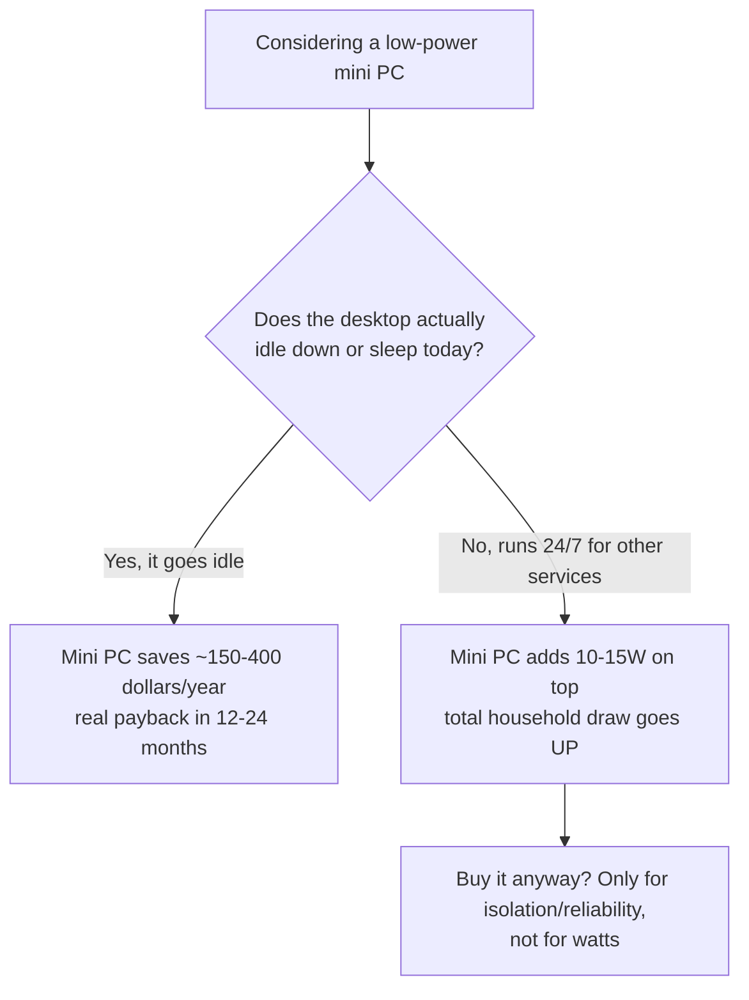

Idle power draw, not the price tag on a mini PC, is what actually decides whether a dedicated low-power compute box saves you money over running everything on a gaming desktop. A gaming desktop idles somewhere around 80-200W depending on the board, PSU, and how many drives are spinning. A purpose-built low-power box, the N100-class mini PCs and similar, idles at 10-15W. That gap is real and it's large. Whether it means anything for your electricity bill depends entirely on one question: does buying the mini PC let the desktop actually power off or sleep when you're not gaming? If the answer is no, the math falls apart, and I found that out the hard way while pricing hardware for my own setup.

## The wattage gap turns into real money over a year

Run the numbers and the case looks obvious. A desktop idling at 80-200W, left on continuously, costs roughly $200-460 a year in electricity depending on local rates. A mini PC idling at 10-15W costs roughly $20-43 a year for the same always-on duty. That's a savings of $150-400 a year, enough to pay back a $300-500 mid-tier mini PC in 18-24 months, or a $90-110 used enterprise small-form-factor desktop in well under a year. On paper this is a fast, boring, obviously-correct upgrade.

The number only works, though, if the desktop's power draw during "off" hours is actually the low idle number and not the number it draws while doing something. A desktop that's rendering, transcoding, or serving requests around the clock isn't idling at 80-200W, it's running at whatever load those tasks add on top of that baseline. The savings calculation compares two idle states. If one of your machines never reaches an idle state, you're not comparing what you think you're comparing.

## Buying a mini PC doesn't save power if the desktop stays on anyway

Here's where my own case broke the clean version of this argument. My desktop wasn't just gaming hardware sitting idle between sessions. It was already running 24/7 to serve a stack of self-hosted services: a media-automation pipeline, a personal trading-research pipeline, and a local broker that arbitrates GPU access for LLM inference. None of that stops when I'm not gaming. The desktop was never going to drop to a true idle state, let alone power off, regardless of what other hardware I bought.

That fact kills the power-savings case outright. Adding a 10-15W mini PC next to a desktop that keeps running at its existing load doesn't subtract 80-200W from my bill, it adds 10-15W on top of what I was already paying. Total household power draw goes up, not down. Anyone pricing this decision purely on wattage needs to check their own uptime pattern first, because the entire payback calculation assumes the expensive box gets to power down once the cheap box exists. Mine didn't, so I didn't get that check to cash.

The whole decision comes down to one branch:

## The case for a dedicated box shifts to reliability once power savings are off the table

So why did I build one anyway? Once electricity cost stopped being the argument, the case for splitting workloads off the desktop moved to reliability, and that argument turned out to be stronger than I expected. Every driver update, every Windows patch, every game that wants a reboot to apply a change takes every hosted service down with it. A media pipeline and a trading-research pipeline don't care about my GPU driver version, but they go offline anyway every time I reboot for one. Decoupling the services from the gaming machine means a driver crash or a game install no longer doubles as a service outage.

Splitting the workloads also removes a category of risk that has nothing to do with watts: a misbehaving game, a bad driver, or a resource-hungry mod shouldn't be able to starve a database import or a scheduled job of CPU and memory it needs. Contention on a shared machine is invisible until it isn't, and I'd rather not find out about it during something time-sensitive. That's a maintenance and stability argument, not a power argument, and it's the one that actually justified the purchase in my case.

## GPU-bound work stayed on the desktop, and that's a separate decision

I did not move everything off the desktop. Local LLM inference stayed exactly where it was, running through the existing GPU-arbitration broker, and that was a deliberate choice, not an oversight. VRAM, not CPU or system RAM, is the binding constraint for local LLM workloads, and VRAM contention with a running game is the one real risk in sharing a GPU between gaming and inference. Video transcoding and CUDA inference use physically separate silicon on the same card, so they mostly coexist fine; a game competing for the same VRAM pool is the actual failure mode to watch for.

Moving LLM inference to its own hardware is a real option, but it's a much bigger and separate spend. A dedicated inference-capable box, something like a Mac Mini M4 Pro with 48GB of unified memory or an AMD Ryzen AI Max+ box with 128GB, runs $600-2000 and only earns its keep under heavy or continuous inference load. Bundling that decision in with "buy a $300 mini PC for CPU-only services" muddies two questions that have different price floors and different payback conditions. I split them on purpose.

## What I'd actually check before buying

Check your desktop's real uptime pattern before you check mini PC prices. If it's already running 24/7 for reasons unrelated to gaming, buying a low-power box will not lower your electricity bill, and anyone telling you otherwise hasn't looked at your actual load. The purchase can still be worth it, but the reason changes: you're buying isolation and uptime, not watts. I ended up repurposing an old laptop I already owned as the dedicated box, running Proxmox, rather than buying new hardware, since the reliability case didn't require the cheapest possible idle wattage, just a second machine that wasn't also my gaming rig. If your desktop genuinely goes idle for long stretches, the wattage math is worth taking seriously, the payback period is short and the number is real. Just do the arithmetic on your own machine's actual behavior, not on the average box in a benchmark.
