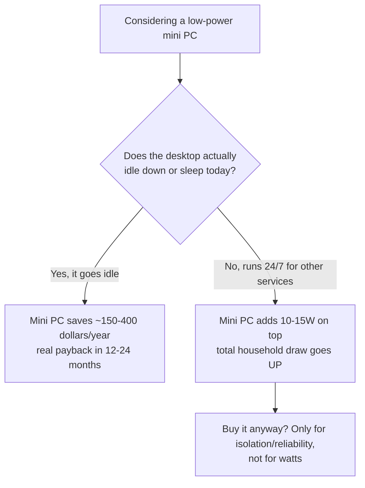

Idle power draw, not the price tag stamped on the mini PC, decides whether a dedicated low-power compute box actually saves you money over a gaming desktop. A gaming desktop idles around 80-200W, depending on the board, the PSU, and how many drives happen to be spinning. A purpose-built low-power box, the N100-class mini PCs and similar, idles at 10-15W.

Whether that gap means anything on your electricity bill comes down to one question: does buying the mini PC actually let the desktop power off or sleep when you're not gaming? If the answer is no, the math falls apart. I found that out the hard way, pricing hardware for my own setup.

## The wattage gap turns into real money over a year

Run the actual numbers and the wattage gap turns into real money fast:

- **Gaming desktop**, 80-200W idle, left on continuously: $200-460/year in electricity (depends on local rates)
- **Mini PC**, 10-15W idle, same always-on duty: $20-43/year
- **Savings**: $150-400/year
- **Payback**: 18-24 months for a $300-500 mid-tier mini PC, or well under a year for a $90-110 used enterprise small-form-factor desktop

On paper, this is a fast, boring, obviously-correct upgrade.

But that number only works if the desktop actually reaches that low idle draw during "off" hours instead of pulling more power doing something else. A desktop that's rendering, transcoding, or serving requests around the clock isn't idling at 80-200W. It's running at whatever load those tasks add on top of that baseline.

The savings calculation compares two idle states. If one of your machines never reaches an idle state, you're not comparing what you think you're comparing.

## Buying a mini PC doesn't save power if the desktop stays on anyway

My own desktop killed the clean version of this argument, because it never stops running long enough to go idle. It wasn't just gaming hardware sitting idle between sessions — it was already running 24/7 to serve a stack of self-hosted services:

- A media-automation pipeline
- A personal trading-research pipeline
- [A local broker that arbitrates GPU access for LLM inference](/blog/debugging-false-positive-gpu-contention-detection/)

None of that stops when I'm not gaming. The desktop was never going to drop to a true idle state, let alone power off, regardless of what other hardware I bought.

That fact kills the power-savings case outright. Adding a 10-15W mini PC next to a desktop that keeps running at its existing load doesn't subtract 80-200W from the bill — it adds 10-15W on top of what I was already paying. **Total household power draw goes up, not down.**

Anyone pricing this decision purely on wattage needs to check their own uptime pattern first, because the entire payback calculation assumes the expensive box gets to power down once the cheap box exists.

Mine didn't, so I never got that $150-400 check to cash.

The whole decision comes down to one branch:

## The case for a dedicated box shifts to reliability once power savings are off the table

Once electricity cost stopped being the argument, **reliability** is what actually justified building a second box, and that case turned out to be stronger than I expected. Every driver update, every Windows patch, every game that wants a reboot to apply a change takes every hosted service down with it.

A media pipeline and a trading-research pipeline don't care about my GPU driver version. But they go offline anyway, every time I reboot for one. Decoupling the services from the gaming machine means a driver crash or a game install no longer doubles as a service outage.

Splitting the workloads also removes a category of risk that has nothing to do with watts: a misbehaving game, a bad driver, or a resource-hungry mod shouldn't be able to starve a database import or a scheduled job of the CPU and memory it needs.

Contention on a shared machine is invisible until it isn't. I'd rather not find out about it during something genuinely time-sensitive: a database import, a scheduled job, whatever happens to be running. That's a maintenance and stability question, separate from anything about power.

## GPU-bound work stayed on the desktop, and that's a separate decision

I did not move everything off the desktop: local LLM inference stayed exactly where it was, running through the existing GPU-arbitration broker. I chose to leave it there instead of moving it along with everything else.

**VRAM**, not CPU or system RAM, is the binding constraint for local LLM workloads, and VRAM contention with a running game is the one real risk in sharing a GPU between gaming and inference. Video transcoding and CUDA inference use physically separate silicon on the same card, so they mostly coexist fine.

Moving LLM inference to its own hardware is a real option. But it's a much bigger, separate spend. A dedicated inference-capable box, something like a Mac Mini M4 Pro with 48GB of unified memory or an AMD Ryzen AI Max+ box with 128GB, runs $600-2000 and only makes financial sense under heavy or continuous inference load.

Bundling that decision in with "buy a $300 mini PC for CPU-only services" muddies two questions that have different price floors and different payback conditions. I split them on purpose.

## What I'd actually check before buying

**Check your desktop's real uptime pattern before you check mini PC prices.** If it's already running 24/7 for reasons unrelated to gaming, buying a low-power box will not lower your electricity bill. Anyone telling you otherwise hasn't looked at your actual load.

The purchase can still be worth it, but the reason changes: you're paying for isolation and uptime. Watts stop being the point. I ended up repurposing an old laptop I already owned as the dedicated box, [the XPS 17 that now runs Proxmox](/blog/proxmox-for-the-xps-17-offload-box/), rather than buying new hardware, since the reliability case didn't require the cheapest possible idle wattage, just a second machine that wasn't also my gaming rig.

If your desktop genuinely goes idle for long stretches, take the wattage math seriously. The payback period is short, and the number is real. Run the arithmetic on your own machine's actual behavior instead of trusting whatever number a random N100 review quotes.
