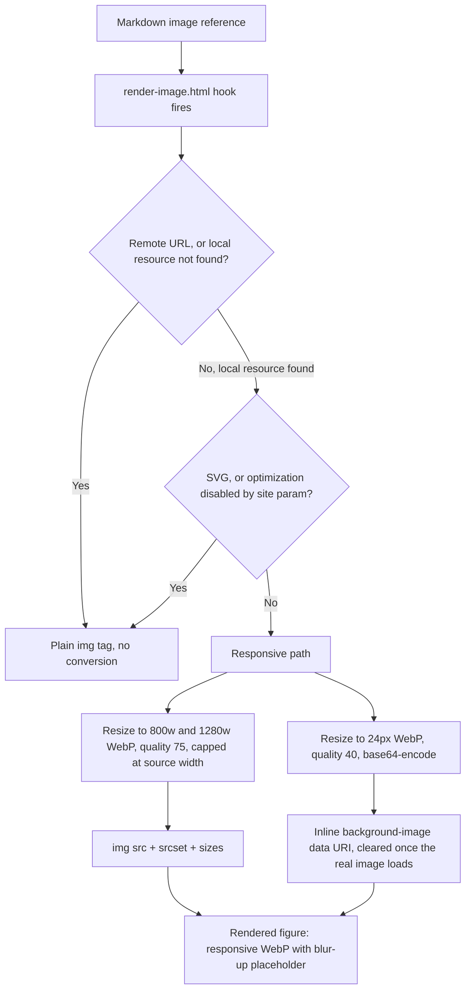

This site had no image pipeline until this week. Every image in every post loaded at its original file size and format, usually a multi-megabyte PNG screenshot, with no responsive sizing and no loading placeholder.

Diagrams had exactly one path in: a Blowfish theme shortcode you had to remember to wrap your diagram in by hand, with no way to drop a diagram into a plain fenced code block the way you would in a GitHub README or almost anywhere else that renders Markdown.

Both problems share a mechanism, so I fixed them in the same pass: [Hugo render hooks](https://gohugo.io/render-hooks/), which let a site override how the built-in Markdown renderer turns one specific element (an image, a code block) into HTML.

## Render hooks, not a CDN

The obvious alternative to fixing this in Hugo would have been an image CDN, a hosted service like Cloudinary or imgix that resizes and reformats images on request. I didn't want a third-party dependency for something Hugo already does natively at build time.

Every image on this blog is a file checked into the repo. Hugo's `resources.Get` and the image processing methods it exposes (`.Resize`, format conversion, quality settings) run once, during `hugo build`, and the output is a static file next to everything else this site already serves — **no runtime cost, no external service, no new failure mode when that service has an outage.**

A render hook is Hugo's supported way to intercept one piece of that build. Drop a template at `layouts/_default/_markup/render-image.html` and every Markdown image reference in every post routes through it instead of Hugo's default renderer. Same idea for code blocks: `layouts/_default/_markup/render-codeblock-mermaid.html` intercepts only the fenced blocks tagged with the language name `mermaid`, leaving every other code block (Python, Bash, YAML, whatever) untouched.

## WebP conversion, responsive srcset, and a blur-up placeholder

The image hook does three things to every local raster image (a PNG or JPEG that isn't an SVG and isn't loaded from a remote URL):

1. **Converts it to WebP** at two widths, 800px and 1280px, quality 75. WebP is a modern image format that produces meaningfully smaller files than PNG or JPEG at the same visual quality. That's the actual win here, since the original screenshots on this blog were often 1–3MB PNGs.
2. **Builds a `srcset`** so the browser picks whichever of the two sizes fits the reader's screen, instead of always downloading the largest version.
3. **Generates a low-quality placeholder.** LQIP stands for low-quality image placeholder: a tiny, heavily compressed preview (24px wide, WebP quality 40) encoded directly into the HTML as a base64 data URI. It shows as a blurred background while the real image loads, then swaps out once the image finishes (`onload`, checking the image actually has real pixels rather than firing on a broken image).

Neither the resizing nor the srcset widths upscale past the source: both are capped at the image's own width, so a small source image never exceeds its native resolution.

Two cases skip all of this on purpose:

- **Remote images** — anything with an `http://`, `https://`, or `data:` URL passes straight through, since Hugo can't resize a file it doesn't have locally.
- **SVGs** pass through unmodified: SVG is already a compact vector format, and converting one to a raster WebP would only make it bigger and blurrier.

There's also a site-wide escape hatch, a `disableImageOptimizationMD` parameter that reverts every image on the site to the original, unconverted file, for the rare case where exact pixel fidelity matters more than page weight.

Here's the decision flow the hook actually runs, from a Markdown image reference to the final rendered figure:

Here's a real image going through that exact path, reused from [the Docker Compose VPN guide on this blog](/blog/secure-services-docker-compose-and-nordvpn/) rather than a synthetic test image, so the pipeline does real work here instead of showing off on a stock photo of a laptop on a beach:

## The bug that would have shipped: images under 800px skipped WebP

[Blowfish](https://blowfish.page/), the theme this site runs on, already had an image render hook, and the one I built started as a fork of it rather than something written from scratch. Its responsive-image logic resized to WebP only inside a conditional gated on the source image's width, and that conditional was written so images narrower than 800px fell through without ever hitting the `.Resize` call.

A screenshot that happened to be, say, 600px wide would render as a plain, unconverted PNG. No WebP. No srcset. No LQIP. No error telling anyone anything had gone wrong.

I caught this during spec review, before it shipped, by deliberately testing against a narrow image instead of only the wide screenshot used elsewhere in this post. The fix: make the WebP conversion **unconditional**. Every local raster image gets resized to WebP now, with each target width capped at `math.Min(originalWidth, 800)` (or 1280 for the larger variant), so a small source image gets downsized cleanly and never upscaled.

A conditional that silently skips work instead of erroring is invisible until someone tests the exact input it was written to exclude.

## Diagrams from a plain code fence, not just a custom shortcode

Before this, the only way to add a diagram to a post was Blowfish's `mermaid` shortcode, Hugo's mechanism for calling a custom template from inside Markdown by name, wrapped around the content it applies to. It works. But it's specific to this theme: paste the same Markdown into GitHub, or into any other Hugo site without that exact shortcode installed, and instead of a diagram you get a wall of raw arrows and brackets sitting on the page as plain text.

[Mermaid](https://mermaid.js.org/), the diagramming library, not the theme feature, has a real, portable convention for this: a fenced code block tagged with the word `mermaid` as its language name, the same triple-backtick-plus-language convention you'd use for any other code block, just with `mermaid` in place of `python` or `bash`. [GitHub](https://docs.github.com/en/get-started/writing-on-github/working-with-advanced-formatting/creating-diagrams), GitLab, and most Markdown renderers already recognize that convention natively.

Hugo's code-block render hook lets this site recognize it too: `render-codeblock-mermaid.html` intercepts any fenced block tagged that way and wraps its raw content in a `<pre class="mermaid">` element, the exact markup the existing shortcode already produced. Same CSS, same Mermaid JavaScript runtime, picked up identically no matter which syntax wrote it. The diagram earlier in this post, the one showing the image hook's decision flow, comes from that exact fenced block instead of a mockup.

## Loading the Mermaid bundle exactly once, from either entry point

Mermaid's JavaScript runtime is a real cost, tens of kilobytes a reader's browser has to fetch and execute, so it should only load on pages that actually use it, and it should never load twice on the same page. Blowfish's theme already handled the first half of that for the shortcode: a partial checks `.Page.HasShortcode "mermaid"` and only then fetches, minifies, concatenates, and fingerprints the Mermaid library and its config into one bundle.

Forking that theme file too would mean re-syncing it by hand on every future Blowfish update. So instead I added a second, narrower check in a site-level partial, `extend-head-uncached.html`. It loads the same bundle only when the page's raw source contains a fenced block tagged `mermaid` *and* the shortcode is absent — that "and shortcode is absent" clause is the **double-load guard**:

- **Shortcode only:** the theme's own check already loads the bundle, so the new check backs off.
- **Fenced block only:** the theme's check is false (no shortcode), so the new check fires instead.
- **Both, like this page:** the theme's check fires and loads it, and the new check backs off, for the same reason as the shortcode-only case.

One script tag, regardless of which syntax, or both, a given post uses.

### The old shortcode syntax still renders on the same page

The diagram below is a regression check more than content in its own right: it's written with the original `mermaid` shortcode syntax, sitting on the same page as the fenced diagram above, to confirm both entry points coexist without loading the Mermaid bundle twice or conflicting with each other.


flowchart LR
    A[Shortcode entry point] --> B[Blowfish's original loader: HasShortcode check]
    B --> C[Same Mermaid runtime bundle]
    C --> D[Renders next to the fenced-block diagram above]


## Where this stands

`hugo build` runs clean across every existing post plus this one. The build output confirms both diagrams render and the image above comes out as WebP with a srcset and a blur-up placeholder rather than a flat PNG.

I also wrote real browser tests, not just a clean build, to catch a regression here automatically. They confirm:

- The Mermaid bundle loads exactly once on this page (both syntaxes present) and stays absent on pages with neither.
- The diagram actually renders as an SVG, rather than sitting as unrendered text.
- Its colors really change between light and dark mode after clicking the appearance switcher.
- The LQIP placeholder clears once the real image loads, rather than just being present in the markup.

One gap I'm not pretending isn't there: there's still no isolated fixture anywhere on this site for "fenced block only, no shortcode" or "shortcode only, no fenced block" in separate pages. This post exercises both at once, which proves the double-load guard but not each syntax fully alone. That guard's logic is simple enough to have checked by reading the template directly, so I'm treating it as covered.
