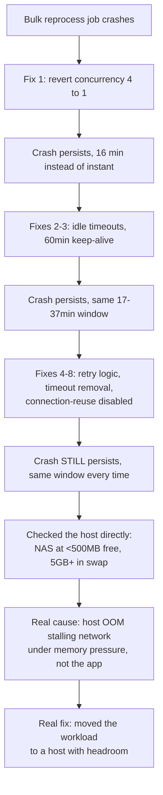

A bulk-reprocess job against one of my LightRAG instances crashed three times in one afternoon, and I shipped eight legitimate fixes before I found the actual cause. That same afternoon I also fixed [a false-positive bug in the GPU broker](/blog/debugging-false-positive-gpu-contention-detection/) that arbitrates my home GPU between gaming and local inference.

The two bugs had nothing to do with each other; they just landed on the same day. The honest version of this story is about the LightRAG crash alone: most of my fixes were correct, and none of them worked.

## The crash looked like a concurrency problem, and the first fix was one

[LightRAG](https://github.com/HKUDS/LightRAG) is a knowledge-graph pipeline I run against a local Ollama embedding backend for a personal research project. I'd triggered its `reprocess_failed` endpoint against an 800-document backlog, and it kept dying with the same signature: an `httpx.ReadError`, then `IndexFlushError`, then `Pipeline halted`, cascading the entire in-flight batch to failed.

A stray backup file on disk showed the cause: an earlier session had quietly raised `MAX_ASYNC` and `MAX_PARALLEL_INSERT` from 1 to 4, chasing throughput without realizing it would destabilize a local embedding backend. **Community guidance is explicit that parallel-insert should stay well under async concurrency, not equal to it**, and that gap matters more against a local model than a cloud API. ([The same knobs, tuned against a rate-limited cloud API instead](/blog/tuning-lightrag-ingestion-concurrency-against-gemini-rate-limits/), got a post of their own.)

I reverted both settings to 1. It was a real bug that had probably been causing failures for a while, but it wasn't the crash.

## Reverting concurrency didn't stop the crash, so I chased connections next

The next run survived sixteen minutes instead of failing instantly, then died with a different-looking error: a stale connection reused after going dead. I added explicit idle timeouts on both sides of my broker's HTTP handling.

Along the way I found a second real bug: Ollama's embedding model was cold-starting every seven to twelve minutes, because idle gaps between embedding bursts routinely exceeded [its five-minute keep-alive default](https://docs.ollama.com/faq), and every one of those reloads was hitting a missing ROCm library file on my GPU. I set a sixty-minute keep-alive to stop the reload cycling entirely.

Both fixes were correct diagnoses of real problems. But the crash came back anyway, at almost the same elapsed time, on a different document.

## Three more fixes landed on real mechanisms with nothing to do with the crash

I kept narrowing, three more fixes deep:

1. A retry layer for connection-level failures on the broker's outbound leg. Real hardening, but the retries never fired; the failure wasn't happening on that leg at all.
2. Removing an inbound idle timeout I'd added earlier, once I realized it was closing connections during LightRAG's own multi-minute merge phases rather than protecting against staleness.
3. Disabling connection reuse entirely on the broker's batch server, so every request got a fresh TCP connection.

Each was a legitimate correction. None changed the outcome. By fix eight I'd addressed concurrency, idle timeouts, a GPU driver bug, retry logic, and connection reuse, and the job still died in the same seventeen-to-thirty-seven-minute window every time. **That consistency was the actual clue.** Something systemic was setting the clock. I kept adjusting the wrong thing.

Here's the shape of the whole afternoon:

## The host itself was out of memory

Checking the NAS's own resource state directly settled it.


The box had 7.7GB of RAM, roughly 38 Docker containers running on it, and under 500MB genuinely free during a live run, with over 5GB in swap and the kernel's swap-reclaim daemon burning real CPU just to keep everything upright.


LightRAG's own footprint was tiny, under 1.5GB, but it didn't need to be large to get caught in the crossfire.

Under that kind of sustained memory pressure, the kernel can stall a process's network handling unpredictably, and from either endpoint's perspective that looks exactly like the other side vanished mid-response. No exception in my code, no crash log on Ollama's side, nothing to grep for.

Every timing and connection fix I'd shipped was chasing a symptom that could show up anywhere the OS decided to stall. **The real culprit was never in my code.** It was 38 Docker containers fighting over 7.7GB of RAM, and losing.

## Moving the workload off the NAS fixed it

I migrated the LightRAG instance off the NAS onto a desktop machine with far more headroom, keeping every earlier hardening change in place. I hit one more mistake during the move.

> [!WARNING]
> Don't point a migrated container at a loopback address, even when co-locating services on the same host. A container has its own network namespace, so `127.0.0.1` inside it isn't the host's loopback; it won't reach a service the host itself is running. Use the host's real local-network address instead.

I'd reasoned that co-locating services meant loopback would work. It doesn't, for the reason above.

Switching to the machine's real local-network address fixed the connection immediately. The reprocess job then ran clean for fifty-two minutes, well past the worst crash point of thirty-seven, with steady progress and zero halts.

I also owe a correction to my own process here. Partway through this, I declared an earlier fix verified after watching a run for thirty clean minutes, then stopped monitoring it to go write notes. The job crashed seven minutes later.


Thirty minutes of no errors isn't proof of anything if you stop watching before the job finishes.


I don't think that mistake changes the eventual diagnosis, but it added a full extra round of debugging that a longer, unattended check would have skipped.

## The GPU broker bug was a genuinely different problem, same day

The other bug that afternoon lived in a completely separate piece of code: the broker that decides when my shared GPU should yield away from local inference toward gaming or Plex. It was yielding every ten to twenty minutes around the clock, including at 1am, because its detector matched on a process name that Plex also runs for background maintenance work like intro-skip detection, not just during actual playback.

The fix was to stop pattern-matching on a process name and start asking Plex's own session API whether anything is actually playing.

I mention it here only because "one bad day" is the accurate frame: two real, unrelated bugs, fixed hours apart, that happened to share an afternoon.

## What I'm not sure about

I'll admit the two bugs aren't fully unrelated in one respect: both started from trusting a single signal without corroborating it, a log line in one case, a process-name match in the other. That's a real pattern in how I was debugging that day, even though the bugs live in different systems.

I'm also not confident I've found the true floor on the embedding-batch size that caused an earlier, secondary instability risk during that same debugging stretch. I picked two over ten and never bisected further. If that pipeline ever needs more throughput someday, I'll have to go back and find the actual safe threshold properly, instead of just assuming two is magic.

But what I am confident about is the general lesson: **when a fix addresses a real, verified mechanism and the crash still recurs on the same clock, stop tuning that mechanism and check what the host itself is doing.**
