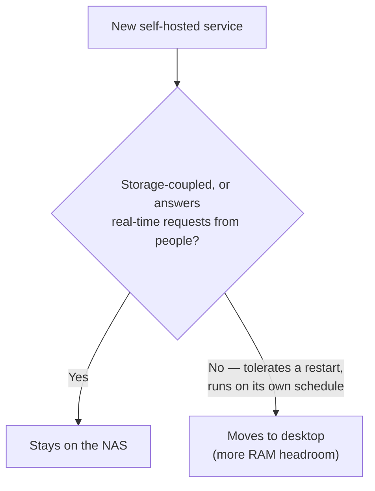

Family-facing and storage-coupled services stay on the NAS. Compute-heavy personal projects move to a separate host with real memory to spare. That's the whole framework, and it took months of pain to earn: a Synology DS1522+ with 8GB of RAM, roughly 35 Docker containers, and a box that kept falling over under memory pressure.

ContainerManager doesn't fail loudly when it runs low on headroom — it just quietly starts murdering things. It stalls. It swaps. Eventually something dies, and figuring out which container actually mattered enough to protect took longer than it should have.

## Storage coupling decides placement, not how important a service feels

A service that's **coupled to storage or answers requests from other people in real time** belongs on the NAS regardless of how heavy it is. A photo backup tool sits next to the disks it writes to — someone in the house opens the app, it has to answer, so it stays put.

A knowledge-graph pipeline or a data-ingestion job is the opposite: it runs on my own schedule, tolerates a restart without anyone noticing, and doesn't need to answer anything at 11pm on a Tuesday. That kind of workload moved to my desktop, which has far more RAM than the NAS and isn't a fragile appliance I need to baby. ([The crash saga that proved the NAS couldn't carry the knowledge-graph workload](/blog/nine-fixes-lightrag-embedding-crash-one-afternoon/) is its own post.)

The shift buys headroom on the box that actually has to stay predictable.

The placement call itself is a simple branch:

## Immich's remote machine-learning support is meant to run alongside the local container, not replace it

Immich, the self-hosted photo app I use for family photo backup, [officially supports running its machine-learning container on a separate host](https://docs.immich.app/guides/remote-machine-learning) from the main server, through the `IMMICH_MACHINE_LEARNING_URL` setting. That's documented, production-used behavior.

The trap is treating it as a full swap: point Immich only at the desktop's ML container, and **Smart Search and Face Detection break outright** the moment the desktop is off, because my desktop isn't an always-on box the way the NAS is. Immich's own docs are explicit about the right pattern instead:

- Keep the local ML container running as a fallback.
- Add the remote URL alongside it, not in place of it.
- Jobs degrade to local processing instead of failing outright.

Facial recognition itself talks to the database directly and doesn't care where the ML container lives, so the underlying Postgres database can stay NAS-side no matter what.

The ML container ships with no authentication at all. Keep it on the local network and never forward it.

## SQLite-backed services migrate cheaply; Postgres-backed services need a logical dump

Migrating a stateful service safely comes down to what's storing its state. Anything backed by SQLite in a config directory — which covers most media-automation tools in the `*arr` family — migrates with a stop-the-container, sync-the-volume, start-on-the-new-host sequence. That's close to zero-risk: the database is just a file sitting still while you copy it.

Postgres is a different problem. Copying a live data directory risks corruption, so the safe path is:

1. Take a logical dump while the source stays running.
2. Transfer that dump to the destination.
3. Restore it, then run a **row-count check before you touch the original**.

I moved a Postgres-backed data pipeline this way and it went cleanly. I'd read enough migration horror stories going in that I probably over-prepared for a problem that never showed up.

## A media library mounted at different paths on two hosts needs a one-time remap

One gotcha cost me more time than the actual migration. Media-automation tools store absolute library paths inside their own database, and if the new host mounts the same share at a different path than the old one did, every stored path is now wrong.

Nothing crashes when this happens. Shows just stop being tracked as monitored, and the failure mode looks like a metadata bug instead of a path problem.

The fix is a **one-time script against the SQLite database** that rewrites the stored root-folder paths to match the new mount layout. It's a five-minute job once you know it's coming, and an afternoon of confused debugging if you don't.

## Monitoring belongs on the host that isn't under memory pressure

A watchdog that lives on the same box it's protecting adds to the exact pressure it's supposed to catch.

I run a lightweight watchdog on the NAS itself — a cron job paired with an [ntfy](https://ntfy.sh/) push notification — because that footprint is small enough not to matter. Anything heavier, like [Uptime Kuma](https://github.com/louislam/uptime-kuma), I'd rather run on the desktop watching the NAS remotely than install directly on the NAS.

Putting monitoring next to the thing it watches feels natural — but on a RAM-constrained box, it's backwards.

## A RAM upgrade is a hedge, not a proven fix

I haven't upgraded the NAS's memory. I genuinely don't know if it would solve the problem I moved workloads to avoid.

Third-party memory is a real risk on this model specifically: at least one report describes a 16GB module in a DS1522+ registering as only 8GB, so the upgrade can fail silently instead of throwing an obvious error.

Even with compatible memory, I couldn't find a solid first-hand account confirming it actually stops the crash pattern rather than just raising the ceiling before it comes back at a higher container count. So it stays on my list as a possible complement to the migration — insurance layered on a split that's already working, not a fix I'm betting the outcome on.

The framework holds up months in, but **the split isn't finished**. Every time a new self-hosted idea shows up, the first question is still which side of the line it belongs on, and I've gotten that call wrong at least once. A stack I placed on the desktop early has since moved a second time, to [the Proxmox box I built from a retired laptop](/blog/proxmox-for-the-xps-17-offload-box/), because "more RAM than the NAS" turned out not to be the same thing as "the right home for this workload."

The framework tells you which way to lean. It doesn't promise you'll land a given workload in the right spot on the first try.
