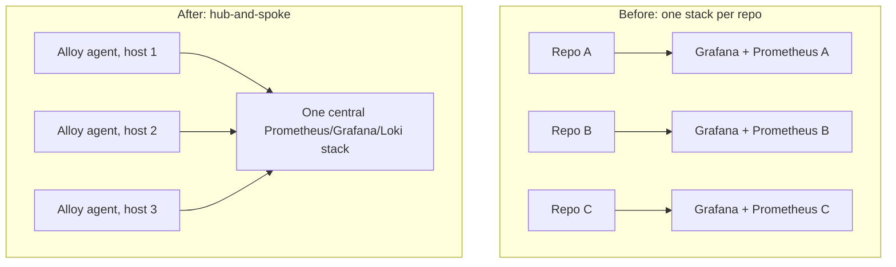

Run one shared Grafana and Prometheus stack for your whole home lab, not one per repo. I have around 30 GitHub repos and 15-20 always-on self-hosted services running mostly on one desktop plus a NAS, and I recently found two separate Grafana containers on that desktop, each spun up by a different project's docker-compose file, each with its own dashboards nobody was cross-referencing. That's the anti-pattern this post argues against, and it happened because "just add a Grafana container to the compose file" felt like the path of least resistance at the time.

## The isolation argument doesn't apply to a personal setup

Per-repo or per-tenant observability stacks exist to solve one problem: hard isolation between parties who must never see each other's data. Grafana Labs' own guidance treats a single shared stack as the default, and reserves multi-tenant splits for cases like separate customers or separate teams inside a company, where combining dashboards would be a compliance or trust violation. None of that applies when every service on your network is yours. There's no tenant boundary to protect, so there's no isolation benefit to buy with the extra containers.

## The resource argument doesn't hold either

A full Prometheus, Grafana, and Loki stack runs comfortably in 500MB to 2GB of RAM on a single host, even in a single-binary "everything in one process" configuration. That number doesn't change much whether it's watching 3 services or 20. Fragmenting into two or three separate stacks doesn't save meaningful memory, because most of that footprint is fixed cost (the databases, the web UI, the query engine) rather than something that scales down with fewer targets. Multiplying that fixed cost across five projects instead of paying it once is pure waste. On my desktop the two duplicate Grafana instances were quietly holding memory that a single shared one wouldn't have needed twice.

## Hub-and-spoke is the actual pattern people run at this scale

Homelab operators running desktop-plus-NAS setups converge on the same shape: one central Prometheus/Grafana/Loki stack, and a lightweight collection agent on every monitored host. The current standard agent is Grafana Alloy, an OpenTelemetry-based collector that replaced the older Grafana Agent (which is now deprecated). Alloy ships metrics, logs, and traces from each host back to the one shared backend using a single config file per host. You install one small agent per machine, not one full stack per project. That's the part I got backwards when I let each project's compose file bring its own Grafana along for the ride.

Keeping the central stack on a separate machine from the workloads it watches also matters. If your monitoring stack lives on the same box as the service it's alerting on, a crash on that box takes out your visibility into the crash at the exact moment you need it. Splitting stack and workload physically, not just logically, is what turns "monitoring" into something you can actually trust during an incident.

Here's the shape of the migration, anti-pattern on the left, target on the right:

## This is the same shared-infrastructure pattern I already use

I already draw a line between shared infrastructure and project-specific code: things like networking and VPN routing live in one dedicated infra repo, and shared libraries get imported by whichever project needs them instead of being copy-pasted. Observability is the same category of thing as networking or shared libraries. It's plumbing every project needs, not something any one project owns. Treating it as project-specific and letting each repo bootstrap its own copy is the same mistake as vendoring a shared library into five places and letting the copies drift.

## The real downside: cross-project noise and a bigger blast radius

The honest cost of consolidating is that one shared stack means one shared failure domain and one shared signal-to-noise problem. A misbehaving data-ingestion service can spam the same Grafana instance that's supposed to be giving you a calm read on a media pipeline's health, and if you don't tag and label rigorously, alerts start blurring together across projects that have nothing to do with each other. A stack outage now takes down visibility into everything at once, instead of just one project. And I'll admit dashboard sprawl is a real risk once ten or fifteen projects are all reporting into the same Grafana instance — without folders and consistent naming, the dashboard list turns into its own mess. None of that is imaginary, and the fix is discipline (consistent labels, per-project dashboard folders, and alert routing that filters by service) rather than pretending the problem doesn't exist because you gave up and split the stacks anyway.

## What I'm actually doing about it

I'm standing up a single Prometheus, Grafana, and Loki stack in my shared infrastructure repo, with Alloy as the collector on every host instead of the deprecated Agent. Each service exposes a metrics endpoint where it has one, and node and container-level metrics get scraped centrally rather than per-project. The two duplicate Grafana instances get their dashboards migrated over and then get decommissioned, one at a time and carefully, since one of those projects touches live financial data and I'd rather not break its alerting mid-migration. The remaining always-on services that currently have zero monitoring, which is most of them, get wired into the shared stack as I go instead of getting their own bespoke setup.

None of this required new hardware or a new product. It required admitting that "quick, add Grafana to this compose file" was a decision I kept making locally that never added up to a coherent system, and that the fix was to stop treating observability as part of each project and start treating it as part of the network.
