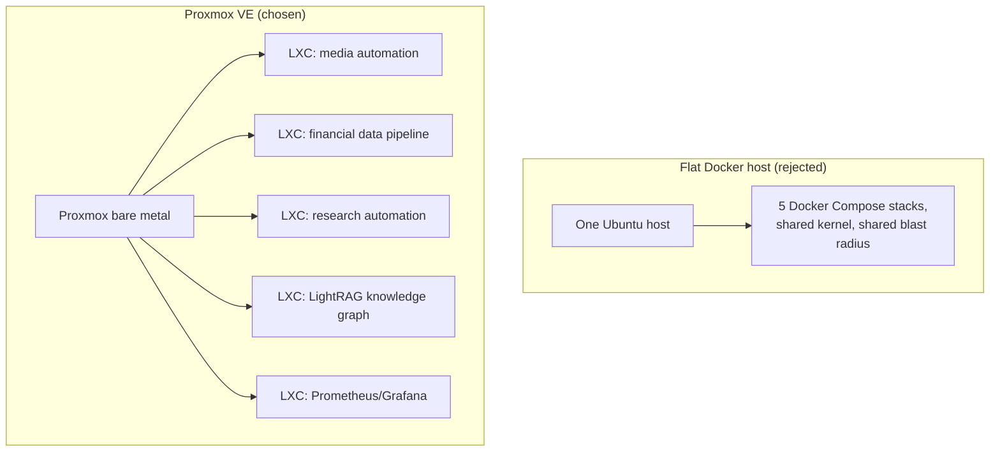

Proxmox VE won the decision, and the reason is simple: five separate workloads sharing one box is exactly the situation where isolation stops being a nice-to-have. I had an old Dell XPS 17 sitting around and a growing list of services that needed a new home. Instead of buying dedicated hardware, I closed the lid, racked the laptop, and pointed five different stacks at it. Picking the OS underneath that decision took longer than I expected, because the obvious answer (plain Ubuntu Server plus Docker Compose, matching every other machine I run) turned out to be the wrong one for this specific job.

## Five workloads on one box changes the math

A single laptop was about to run a media-automation stack ([deciding which containers even belong where](/blog/not-every-docker-container-belongs-on-the-nas/) was an earlier chapter of the same story), a financial data-ingestion pipeline, a research-automation pipeline, a [knowledge-graph service built on LightRAG](/blog/tuning-lightrag-ingestion-concurrency-against-gemini-rate-limits/), and a Prometheus/Grafana monitoring stack. Each of those is its own multi-container application with its own dependencies, its own restart policy, and its own blast radius if something goes wrong. Running all five as Docker Compose stacks directly on one Ubuntu install works fine until one of them needs a kernel module the others don't, or a bad `docker compose down -v` on one project takes out a volume mount that another project happened to share. Isolation is the whole argument. When you're running one app, bare metal plus Docker is simpler and I'd pick it again without hesitation. When you're running five unrelated apps that used to live on five different sets of assumptions, a hypervisor layer that can wall each one off starts paying for itself.

## Proxmox VE's per-workload containers made the isolation case concrete

Proxmox VE is a free, Debian-based hypervisor that runs VMs and LXCs (Linux containers that isolate at the kernel-namespace level, lighter than a full VM but heavier than a Docker container) side by side, managed through one web UI and API. The plan that came out of the research was Proxmox on bare metal, with one LXC per workload, each running its own Ubuntu or Debian userland and its own Docker daemon inside. That gives every stack its own filesystem snapshot and its own rollback point. If the knowledge-graph service breaks something in an upgrade, I can snapshot before, wreck the container trying to fix it, and roll back in under a minute, without touching the other four workloads. A flat Docker host can't give me that; a bad `apt upgrade` or a stray volume prune affects everything on the box at once. As of [Proxmox VE 9.2 in mid-2026](https://pve.proxmox.com/wiki/Roadmap), it's built on Debian 13, which means the underlying package base is the same stable Debian everyone already trusts, just with a newer kernel and better hardware support layered on top.

Here's the shape of the box either way — the rejected flat host on top, the isolation Proxmox actually buys below it:

## Fedora Server lost on two separate grounds

Fedora Server was in the running early and got cut for two reasons, not one. First, Fedora Server defaults to Podman instead of Docker, and every workload I was moving over already had working `docker-compose.yml` files. Moving to Fedora would have meant either bolting Docker back on top of a distro that doesn't want it there, or rewriting five stacks' worth of compose files against Podman's command differences. Second, [Fedora maintains each release for roughly 13 months](https://docs.fedoraproject.org/en-US/releases/lifecycle/), and this box is meant to be racked and left alone. A "rack it and forget it" machine and a distro that forces a major-version upgrade about once a year are a bad match. Either problem alone might have been worth working around. Together they weren't worth it.

## The real downside: this isn't a flat SSH target anymore

I run two other machines on this network the same way: SSH in, you're on the box, you run Docker Compose, done. Proxmox breaks that pattern. Now I SSH into the hypervisor host first, then hop into whichever LXC I actually need to touch. That's a second layer of indirection every single time I want to check a log or restart a container, and it's a real cost, not a hypothetical one. I went into this decision aware of it and still made the tradeoff, because five isolated workloads beat one flat access pattern, but anyone copying this setup should know that convenience is what you're giving up. I don't love it. Some days I still type the wrong SSH target out of habit and have to back out and hop again.

The laptop-specific gotchas turned out to matter more than the distro choice itself. Built-in Wi-Fi cannot bridge to Proxmox VMs or LXCs, full stop — [the Proxmox WLAN wiki page](https://pve.proxmox.com/wiki/WLAN) is blunt about it. The wireless card only associates with the access point directly, so any container trying to reach the network through a bridged Wi-Fi interface gets its frames silently dropped at the AP. That's not a driver bug you can patch around; it's how 802.11 associations work. The fix is wired Ethernet only, which meant confirming the XPS 17 actually had a working port before I bothered racking it. The other gotcha is that laptops suspend when you close the lid, and a suspended hypervisor is a hypervisor that just stopped running your services. The fix lives in two config files: [`HandleLidSwitch=ignore`](https://manpages.debian.org/testing/systemd/logind.conf.5.en.html) in `/etc/systemd/logind.conf` (and the matching line in `sleep.conf`) so closing the lid doesn't trigger suspend, plus `consoleblank=300` on the kernel boot line so the display blanks instead of the system sleeping. Both fixes are well-documented and have shown up independently across guides going back to 2022, so this isn't a fragile hack, it's the standard answer to "how do I run a laptop headless."

## The box is live, and the isolation argument held up

I took the Proxmox route, and the box has been running since. Media automation and a newer monitoring workload moved over cleanly, each in its own container, and I've already used a snapshot rollback once when an upgrade inside one LXC went sideways, without any of the other four workloads noticing. The one thing still unresolved is a research pipeline that ended up duplicated across two machines during the migration, an unfinished cleanup rather than a design flaw. If I were doing this again for a single app, I'd skip the hypervisor and just run Docker on bare metal. The extra SSH hop is a real tax I pay every day. But for a laptop absorbing five workloads that used to trust five different sets of assumptions about the box under them, the isolation is worth the tax.
