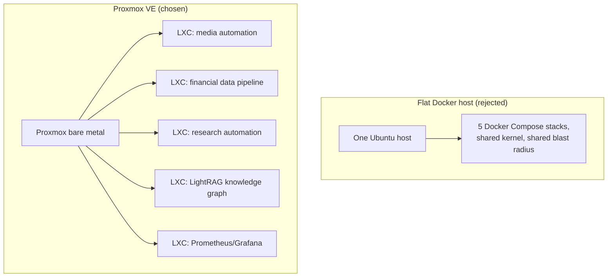

Proxmox VE, one LXC per workload. I think I made the right choice, and I feel good about the reuse: I wouldn't buy a laptop to do this, but I'm happy I found an economical use for one that was already here.

The XPS 17 had been sitting there for a year or two. I tried giving it to a friend and he didn't want it. I tried selling it online and it was a whole pain, I kept getting lowballed. Meanwhile my desktop was overloaded and having ethernet in/out issues with all the data transfers going through it, and it was getting annoying. There's a server rack under my desk with some space in it. So I figured, why not.

What moved: [the arr stack](/blog/not-every-docker-container-belongs-on-the-nas/) (Sonarr, Radarr, Prowlarr, qBittorrent, NZBGet), a financial data pipeline, a research-automation pipeline, [a LightRAG knowledge graph](/blog/tuning-lightrag-ingestion-concurrency-against-gemini-rate-limits/), and Prometheus/Grafana. That's some of the compute off my main desktop and onto a laptop nobody wanted, which is the whole point.

## Why Proxmox and not Ubuntu plus Docker

Every other machine I run is Ubuntu Server plus Docker Compose. For one app I'd do that here too. Five unrelated stacks on one kernel is a different situation: one `docker compose down -v` in the wrong directory takes out a volume another project mounted, and one bad `apt upgrade` hits all five. Proxmox gives each stack its own LXC with its own Debian userland and its own Docker daemon, and each LXC gets a filesystem snapshot I can roll back in under a minute without the other four noticing. As of [Proxmox VE 9.2](https://pve.proxmox.com/wiki/Roadmap) it's Debian 13 underneath, so it's the base I already trust with a newer kernel.

Fedora Server was the other candidate. Podman by default, when I have five stacks of working `docker-compose.yml`, and [each release is supported for about 13 months](https://docs.fedoraproject.org/en-US/releases/lifecycle/) on a machine I want to rack and forget. So it was out.

The cost is one more SSH hop, into the Proxmox host and then into the LXC, every time I touch a container. I knew that going in.

## The laptop parts

Nothing really bothered me. The XPS 17 has no Ethernet port, and [Proxmox can't bridge containers over Wi-Fi](https://pve.proxmox.com/wiki/WLAN): the wireless card only associates for itself, so a bridged container's frames get dropped at the access point. I had a spare USB-C-to-Ethernet dongle. Plugged it in, Proxmox reassigned `nic0` to it, `vmbr0` was already bridging `nic0`, done.

The lid: set the three `HandleLidSwitch*` directives to `ignore` in [`/etc/systemd/logind.conf`](https://manpages.debian.org/testing/systemd/logind.conf.5.en.html) and put `consoleblank=300` on the kernel line. Closed the lid with an SSH session open and it stayed up.

Two small ones. Bare Proxmox doesn't ship `sudo`, so `apt install sudo` as root before you set up a service user. And Proxmox 9 uses deb822 `.sources` files, so the enterprise-repo 401s go away by disabling `pve-enterprise.sources` and `ceph.sources` and adding `pve-no-subscription.sources`.

The one thing that is finicky is the power plug. I have to jiggle it just right and have it sit just right for it to be recognized.

## Nothing is ever perfect

The arr stack and [the resale-clothing monitor](/blog/deciding-what-fits-resale-clothing-monitor/) are running on the box now. The NBA data pipeline is running on both the desktop and this box, and I haven't picked one yet.
