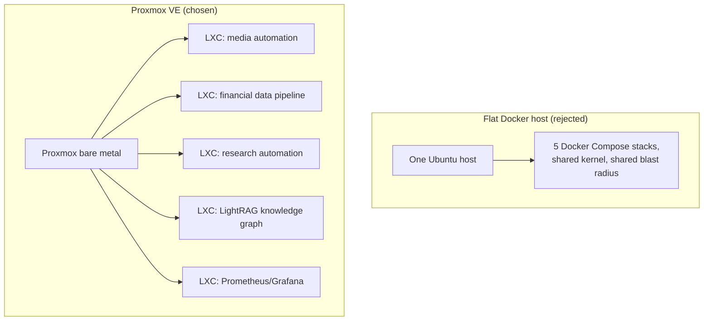

Proxmox VE, one LXC per workload, because five unrelated stacks were about to share one laptop and I wanted to snapshot and roll back each one without the other four noticing. The cost is an extra SSH hop every single time I touch a container. I knew that going in, and I still type the wrong host about once a day.

The laptop is a Dell XPS 17 that had been sitting in a drawer. It's racked now with the lid shut, running [the arr stack](/blog/not-every-docker-container-belongs-on-the-nas/) (Sonarr, Radarr, Prowlarr, qBittorrent, NZBGet and friends), a financial data pipeline, a research-automation pipeline, [a LightRAG knowledge graph](/blog/tuning-lightrag-ingestion-concurrency-against-gemini-rate-limits/), and Prometheus/Grafana. I spent longer picking the OS than doing the migration. Every other box in the house is Ubuntu plus Docker Compose, and I assumed this one would be too.

## Five stacks on one kernel is a blast-radius problem

Each of those is its own multi-container app with its own dependencies and its own way of breaking. On a flat Ubuntu host they share a kernel, and one `docker compose down -v` in the wrong directory takes out a volume another project happened to mount. For one app I'd still pick bare metal plus Docker without thinking about it. For five that used to live on five different machines with five different assumptions, I wanted walls.

Proxmox gives each stack its own LXC with its own Debian userland and its own Docker daemon, and each LXC gets a filesystem snapshot. Snapshot, do the risky thing, roll back in under a minute if it goes wrong, and Sonarr never finds out. As of [Proxmox VE 9.2](https://pve.proxmox.com/wiki/Roadmap) it sits on Debian 13, so it's the base I already trust with a newer kernel on top.

## Fedora Server was out in about ten minutes

Podman by default, and I had five stacks' worth of working `docker-compose.yml` files I wasn't going to port. And [Fedora supports each release for roughly 13 months](https://docs.fedoraproject.org/en-US/releases/lifecycle/). This box is meant to be racked and ignored, and Fedora would want a major-version upgrade about once a year.

## The laptop bit harder than the distro choice did

The XPS 17 has no Ethernet port. I installed Proxmox over Wi-Fi, which works for the host and for nothing else: [the Proxmox WLAN page](https://pve.proxmox.com/wiki/WLAN) is blunt that a wireless card only associates for itself, so frames from a bridged container get dropped at the access point. It's how 802.11 associations work; no driver update fixes it. A USB-C-to-Ethernet dongle did. Proxmox quietly reassigned `nic0` from the wifi card to the dongle, `vmbr0` was already bridging `nic0`, and wired networking came up with zero config changes. I'd budgeted an evening for that.

Then the lid. Close it and a laptop suspends, taking all five services with it. Set all three `HandleLidSwitch*` directives to `ignore` in [`/etc/systemd/logind.conf`](https://manpages.debian.org/testing/systemd/logind.conf.5.en.html) and put `consoleblank=300` on the kernel line so the panel blanks instead of the box sleeping. I tested it the dumb way: closed the lid, kept an SSH session open, waited. It stayed up.

Two smaller ones, since you'll hit them too. Bare Proxmox doesn't ship `sudo`, so `apt install sudo` as root before you set up any service user. And Proxmox 9 moved apt sources to deb822 `.sources` files, so the enterprise-repo 401s go away by disabling `pve-enterprise.sources` and `ceph.sources` and adding a `pve-no-subscription.sources`, not by editing `.list` files that aren't there anymore.

## The bet's held so far, with one loose end

The arr stack and [the resale-clothing monitor](/blog/deciding-what-fits-resale-clothing-monitor/) moved over cleanly, each in its own container. I've used a snapshot rollback once already, when an upgrade inside one LXC went sideways, and nothing else on the box noticed.

The SSH hop is still annoying.

Loose end: the NBA data pipeline is running on both the desktop and this box right now, and I haven't picked one yet.
