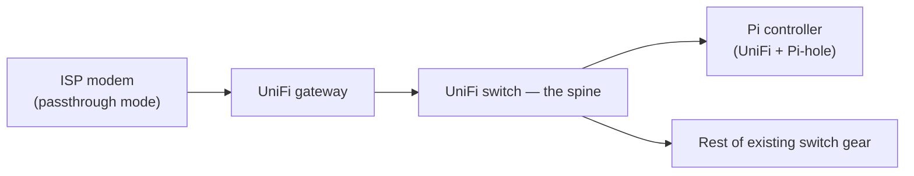

I rebuilt my home network from the ISP modem outward, not by dropping in a new router and hoping the rest of the stack sorted itself out. The order was fixed:

1. Modem into **passthrough** (a mode where the ISP box stops doing routing and just hands its public IP straight through).
2. UniFi gateway and switch as the core.
3. Pi-hole DNS filtering on a Raspberry Pi controller.
4. Every downstream device reconnected one at a time.

Bottom-up, slowest layer first. Nothing skipped ahead of what it depended on.

## Starting at the modem forces every later phase to be honest

Most rebuild guides start at the router, because the router is the interesting box. I started at the AT&T modem instead, because it's the one thing everything else would eventually depend on. Get it wrong there and you're redoing every phase that comes after it.

A gateway sitting behind a modem that's still doing its own routing and NAT gets a private IP instead of the real one, and half its features either misbehave or silently don't work. Fix that after the fact and you're re-wiring a spine you already built. Fix it first, and every phase after stands on a foundation that's actually solid.

## The Pi controller has to prove itself before touching hardware

Before I unplugged a single cable, I checked that the Raspberry Pi meant to run both the UniFi controller software and Pi-hole was actually in working order. That's a controller and a DNS filter sharing one small board, so if the board is flaky, both systems inherit the problem.

I SSH into the Pi directly, not through any intermediate device, and check three things:

- The UniFi controller process is running.
- Pi-hole's FTL service is active.
- Pi-hole's local API responds.

If any of those fail, I fix them before phase one starts. A rebuild with an unreliable controller doesn't announce itself — it just produces mystery failures later that look like network problems and aren't.

## Physical inspection beats trusting old notes

The next step was confirming what the UniFi switch actually was: model, MAC address, firmware version. I had this written down from an earlier setup, but hardware gets swapped and notes go stale. I checked the label on the unit itself instead of trusting a document from months ago — skipping that step is how you end up troubleshooting a switch that isn't the switch you think it is.

## Factory reset comes before adoption, not after

I factory reset the UniFi gateway before letting the controller adopt it, instead of adopting whatever configuration state it happened to be in. Holding the reset button through a full LED flash cycle wipes prior config and puts the device back to a known default. That matters, because adopting a gateway with leftover settings from a previous topology is how you get rules that contradict what you're about to build.

Once it settles, the gateway is reachable at its default local address over a direct wired connection, and that's the state I want walking into adoption.

## Adoption is where the controller and the gateway agree to work together

[Adoption is UniFi's term](https://help.ui.com/hc/en-us/articles/360012622613-UniFi-Device-Adoption) for a device formally joining a controller: the controller pushes its configuration down, the device reboots into it, and from then on the controller manages it. The steps:

1. Connect a laptop directly to the gateway's LAN port.
2. Open the controller's web dashboard from the Pi.
3. Adopt the gateway once it shows up as pending.

Most of the time this works from the UI in a few minutes. But when it doesn't, there's a **command-line fallback** that points the device at the controller's inform address directly, run over a direct SSH session into the gateway itself, and then the UI adoption is retried. I didn't need the fallback this time, but I wrote it into the plan anyway, because the one time you skip documenting the fallback is the one time you need it at 11pm.

## Wiring the spine follows a strict power-on order

Physical wiring came after every device was individually verified, not before:

- The modem's LAN port feeds the gateway's WAN port.
- The gateway's LAN port feeds the UniFi switch, which acts as the spine, the central point everything downstream connects through.
- The switch feeds the Pi controller on one port and the rest of the existing switch gear on another.

Power-on order matters too — skipping it doesn't necessarily break anything, but it's one more variable I didn't need while troubleshooting a fresh spine.

Here's the spine those wiring steps actually build, in the order signal flows through it:

Power-on order runs switch first, then gateway, then the Pi last, so the gateway always has something to talk to the moment it boots.

## Passthrough is a modem setting, not a gateway setting

Passthrough gets configured on the ISP modem, not on the UniFi side, which is a detail that trips people up. It lives in the modem's own admin firewall settings, tied to the gateway's MAC address so the modem knows which downstream device gets the real public IP.

After enabling it and letting the modem reboot, I check two things:

- The gateway's WAN interface picked up a public IP, not a private one handed out by the modem's own NAT.
- The controller's dashboard shows that same address.

If those two don't match, passthrough isn't actually active yet, no matter what the modem's settings page claims.

## Pi-hole runs on the same board as the controller, which is a real tradeoff

[Pi-hole](https://pi-hole.net/) filters DNS requests before they leave the network, blocking ads and unwanted domains at the resolver instead of per-device. Running it on the same Raspberry Pi as the UniFi controller keeps the hardware footprint small, and for a home network that's a fine tradeoff.

It also means a single board failure takes out both the DNS filter and the controller UI at once — a shortcut worth being honest about instead of glossing over.

## Where downstream devices land was a decision I hadn't made yet

Here's the part of the plan I can't write up as finished, because it wasn't. Before the rebuild, the NAS, desktop, laptop, and a couple of media devices connected straight into modem ports, flat, no managed switch in the path. Once the modem is just a passthrough bridge and the UniFi gateway is the real router, those devices need a new home: stay on the old flat ports and lose DHCP consistency with everything else, or get rewired into the managed spine and gain it.

I listed four options in my planning notes and didn't pick one. It touches a NAS with a bonded network connection I didn't want to reroute on a guess ([the same NAS whose workload placement got its own post](/blog/not-every-docker-container-belongs-on-the-nas/)), and a couple of devices whose physical cable runs I hadn't confirmed. That's an honest gap — I'd rather admit the plan stalled on a real unknown than pretend I closed it out.

## The plan mattered more than the finish line

What I actually got out of this wasn't a finished network. It was a sequence I trust: verify the controller, confirm hardware, reset before adopting, wire in a fixed order, flip passthrough, filter DNS, and only then touch the devices that depend on all of it. Each phase has a clear pass or fail condition, which means when something breaks later, I know roughly which layer to check first instead of guessing across the whole stack. The device-landing question is still sitting there unresolved, and I'd rather leave it open in writing than pretend the rebuild wrapped up neatly. It didn't, not yet.
