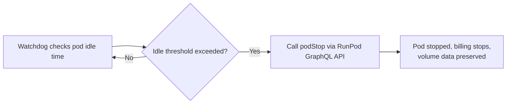

I run vision-model inference for a personal image pipeline on RunPod GPUs instead of calling Google's Gemini API, and the decision has nothing to do with accuracy. Gemini wins on accuracy. RunPod wins on cost, as long as I babysit it correctly, and the babysitting turned out to be the actual engineering problem. This is a companion piece to [the estate-sale scanner series](/blog/scrape-score-alert-resale-hunting-pipelines-local-vision-models/) on this blog, one narrow decision about where the vision step runs, not a rewrite of that whole pipeline.

## Gemini scores higher on accuracy, but my pipeline doesn't need every field to be right

Gemini 2.5 Flash tops a structured-extraction benchmark for vision-language models (VLMs, models that take an image and text prompt together and return structured output) at 0.75 mAP, the highest score of any model tested, self-hosted or managed. A self-hosted model like Qwen2.5-VL trails that number on raw accuracy. What it doesn't have is a marginal cost per call. Every image I send to Gemini costs money regardless of volume; every image I send to a GPU I already control costs whatever fraction of an hour that request occupies the card.

That gap only matters if the pipeline can tolerate the accuracy Qwen actually delivers, and mine can. Every field my pipeline extracts carries a confidence tag, and low-confidence lines get flagged for a human glance instead of trusted outright. A task that needs every field right on the first pass shouldn't make this trade. Mine doesn't need that, so the cost side of the ledger got to decide.

## Serverless pricing looked like the whole answer until I read the sizing requirements

RunPod's serverless tier scales to zero between requests, so idle time costs nothing, which is the actual reason serverless is attractive for a personal project with bursty traffic. But Qwen2.5-VL isn't a drop-in fit on a serverless worker. Community deployment threads put it on 48GB-class cards, L40, L40S, or RTX 6000 Ada, with GPU memory utilization tuned to 0.90 and prefix caching turned on just to fit the model weights alongside the KV cache the image tokens generate. [vLLM's own multimodal serving docs](https://docs.vllm.ai/en/latest/features/multimodal_inputs/) require setting `--limit-mm-per-prompt` explicitly, for example `image=1` for a pipeline that sends one photo per request, because the default silently drops image inputs instead of accepting them.

None of that is disqualifying, but it isn't free either, and the same vLLM community thread that gave me the sizing numbers also flags multi-image batching efficiency as an open problem with no confirmed fix. I don't send multiple images per request today, so that gap doesn't block me, but it's a sign the serverless-vision path is younger than the serverless-text path I've used elsewhere. I'm not treating serverless as a settled choice for this workload yet.

## Dedicated pods are cheaper per hour, and that's exactly what makes them dangerous

A dedicated RunPod GPU, an A40 with 48GB running a vLLM template, prices out around $0.44 an hour, a small fraction of what a larger card costs me for other GPU work I run at home. At that rate, a dedicated pod running vision inference all day still costs less than a handful of Gemini calls at any real volume. The catch is that a dedicated pod bills for every minute it's running, whether or not anything is calling it.

Serverless pods scale to zero automatically. Dedicated pods don't, and I went looking in RunPod's own docs assuming I'd just missed a toggle. There isn't one. [RunPod's GraphQL API documents a `podStop` mutation](https://docs.runpod.io/sdks/graphql/manage-pods), `podStop(input: {podId: "ID"}) { id desiredStatus }`, which stops a pod and preserves its volume data, but there's no built-in idle timeout anywhere in the dedicated-pod management docs. Idle-auto-stop is a serverless feature. A dedicated pod left running after the last request just keeps billing by the minute until something outside RunPod tells it to stop.

## I built a watchdog because nothing else was going to call podStop for me

Once I confirmed the gap was real and not a documentation oversight, the fix was straightforward: an external watchdog that checks how long the pod has been idle and calls `podStop` once that idle window passes a threshold I set. This wasn't a workaround I invented out of necessity. RunPod's own cost-control guidance recommends exactly this shape: treat the GPU as fully ephemeral, let an external scheduler launch the pod, and have either the job itself or the scheduler call stop once the work is done. Pods bill minute by minute while running, so the whole cost argument for choosing a dedicated pod over Gemini falls apart if nothing is watching the clock. I'd already written a version of this watchdog for a different self-hosted GPU job, so this was mostly reusing a pattern rather than inventing one from scratch.

Here's what the watchdog actually does, on a loop:

## What I still haven't proven

I've committed to dedicated-pod-plus-watchdog for now, but I haven't run a real head-to-head between serverless and dedicated at my actual production volume yet. The sizing and batching caveats from the vLLM community are enough to make me wary of trusting serverless vision inference on faith, so a dedicated pod with a watchdog is the safer default while that's unverified. I could end up moving to serverless once I actually benchmark cold-start latency and per-image cost against what the watchdog setup gives me today. For now, the dedicated pod is cheaper, the watchdog keeps it honest, and I'd rather admit that's a decision I haven't fully stress-tested than pretend the comparison is closed.
