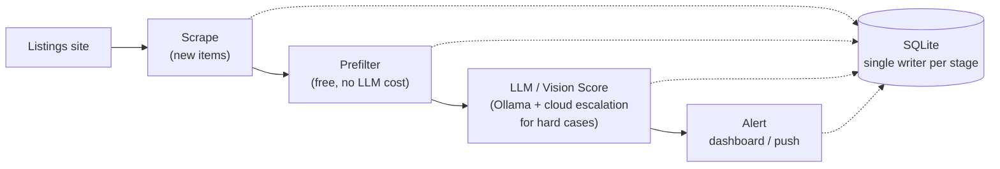

Two personal tools I've built, an estate-sale scanner and a resale-clothing monitor, run on the exact same architecture: scrape listings, score every photo with a local vision model, surface only the ones worth my attention. Same four stages, same database, same GPU, underneath two very different projects.

This post covers that shared foundation and the two decisions in it I'm still not fully sure were right. Two follow-ups go deep on how each project decides what actually counts as a match: [Deciding what's worth a Saturday](/blog/deciding-whats-worth-a-saturday-estate-sale-scanner/) for the estate-sale scanner, and [Deciding what fits](/blog/deciding-what-fits-resale-clothing-monitor/) for the resale monitor.

## One pipeline, two projects, no message queue

Both projects are the same four stages, talking to each other through a single SQLite database instead of a queue:

A run is one process that walks through the stages in order and writes its results to disk as it goes. The next stage reads whatever the last one left behind. I'd defend that against anyone who reflexively reaches for a queue on a hobby project this size: at dozens to low hundreds of listings per run, a queue buys nothing and costs a service to operate and monitor.

The choice isn't free, though. The first time I want two scrapers writing to the same SQLite file at once, or want one stage to retry independently of the one before it, this is the design that starts to hurt. I haven't hit that yet. I expect I will.

What differs between the two projects is entirely inside the middle two boxes: what gets filtered out before it costs anything, and what the model actually gets asked to judge. That's what the next two posts cover.

## One shared GPU forces the same cost tradeoff on both projects

Both pipelines lean on the same home-lab constraint: [one GPU, shared with everything else that machine does](/blog/debugging-false-positive-gpu-contention-detection/), including gaming and media transcoding. That constraint shapes the architecture more than almost anything else.

Neither obvious option worked alone:

- **Cloud, unthrottled:** the strongest available vision model, run on every image, priced out at ten to twenty times a reasonable monthly budget.
- **Local, unbounded:** running everything on the home GPU worked, but a full pass over a week's photos took on the order of a day — on a machine other people in the house wanted to use in the meantime.

That's why both projects ended up with a tiered cascade instead of calling the best model on everything:

1. Cheap local checks run first.
2. A stronger model runs only on what survives.
3. An optional even-stronger model handles genuinely ambiguous cases.

Fitting a large vision model onto a consumer-class GPU brought its own failure mode. The full-precision checkpoint of one candidate model didn't fit, and it left the worker in a permanently unhealthy state until I switched to an **FP8-quantized** build of the same model, which loaded cleanly.

Serverless GPU workers scale to zero when idle, which is exactly what keeps cost near zero between runs, but they carry a real cold-start cost too. One backend took roughly eight minutes to spin up from cold, against a hardcoded two-minute timeout on the client side.

That mismatch was a guaranteed failure on the first image of every single run. It stayed that way until I timed the cold start myself, instead of assuming a fixed timeout was generous enough.

Neither [Ollama](https://ollama.com/) instance gets addressed directly by IP in either codebase anymore. ([Where the stronger vision tier runs, and what it costs to keep a cloud GPU honest](/blog/runpod-vs-gemini-vlm-inference-idle-auto-stop-gap/), became its own decision.) Both pipelines read a plain environment variable for wherever inference happens to be running. That decision paid off the first time I moved the GPU host.

## The scoring logic is where the two projects genuinely diverge

The scoring logic is different enough between the two projects that it doesn't fit here. [Part 2](/blog/deciding-whats-worth-a-saturday-estate-sale-scanner/) covers the estate-sale scanner's asymmetric feedback loop, where a bad sale and a good sale teach the system very different things. [Part 3](/blog/deciding-what-fits-resale-clothing-monitor/) covers the resale monitor's two-pass scoring and a false-positive bias I haven't fully stress-tested.
