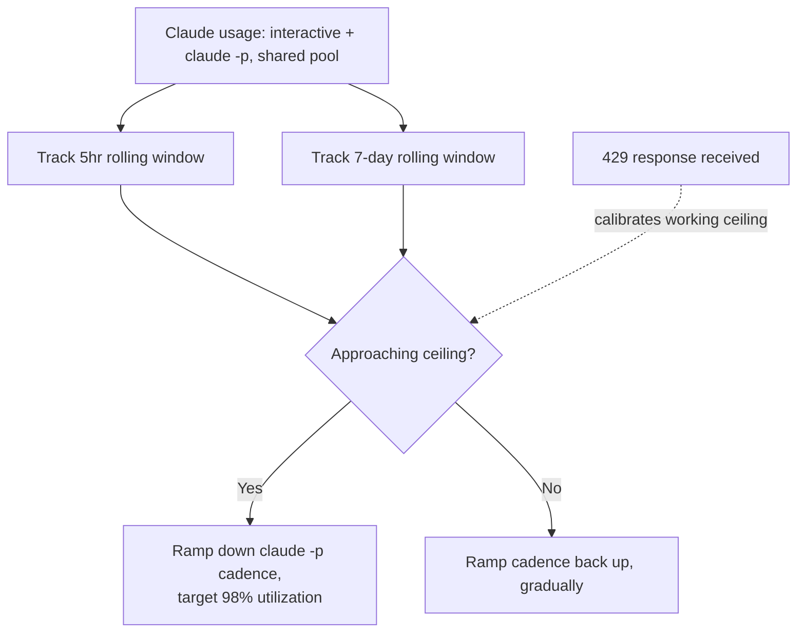

Anthropic will not tell you how many tokens or messages Claude Max 20x actually gives you, and I had to build a throttle for it anyway. I run several personal research projects on background schedules through `claude -p` — unattended fires that call Claude Code from cron and systemd timers while I'm not watching. Those fires draw from the **exact same quota** as the interactive Claude Code sessions I use to do actual work.

If a background job burns the pool at 2pm, my 2:15pm session pays for it. [A single $364 session](/blog/what-a-364-dollar-claude-code-session-taught-me-about-agent-hygiene/) made that competition concrete enough to build against. I wanted those jobs to back off automatically as usage climbed, and hand the room back the moment I sat down to work. Anthropic gives you nothing to calibrate that against.

## Anthropic only publishes a ratio

[Anthropic's Max plan documentation](https://support.claude.com/en/articles/11049741-what-is-the-max-plan) defines the 20x tier as "20 times more usage per session than the Pro plan," and that's the entire spec. No token count, no message count, no per-window number anywhere in Anthropic's own docs.

Everything else is qualitative: usage scales with conversation length, model choice, and effort level. I went looking for a hidden number to hardcode against and confirmed there isn't one, at least not one Anthropic publishes.

That absence isn't a documentation oversight. It's a load-bearing consequence of the ceiling itself moving. [Anthropic doubled the 5-hour rate limit for Claude Code](https://www.anthropic.com/news/higher-limits-spacex) on Pro, Max, and seat-based Enterprise plans on 2026-05-06, and removed a peak-hour reduction that had applied to Pro and Max accounts on the same date.

Any number I'd baked into a governor before that date would have been wrong the moment it shipped, silently, with no changelog entry pointing at my config file. **A governor built against a fixed assumed ceiling is a governor built to go stale.**

## One pool, two independent windows, and a hidden sub-cap

The quota itself isn't even one thing to track. Usage across claude.ai, Claude Code, and Claude Desktop draws from a **single shared pool**. Anthropic states this directly, and it's the fact that makes the whole problem real: a scheduled background fire and an interactive session compete for the same resource, so I can't reason about them as separate budgets.

On top of that shared pool sit multiple caps on different clocks:

- **5-hour session window:** resets from the timestamp of your first prompt, not wall-clock time, so two people starting a session an hour apart are on different reset schedules even on the same day.
- **Weekly cap, all models:** sits above the session window.
- **Weekly cap, Sonnet only:** narrower, and layered inside the all-models cap.

A governor that only watches the 5-hour window runs headlong into the weekly Sonnet cap with no warning. That cap can bind long before the session window ever does.

## The acceleration limit rules out a hard stop-start throttle

The design constraint that changed my approach most is an **acceleration limit**: Anthropic's rate limiter applies something like it, where a sharp spike in request volume can trigger a 429 even with headroom remaining in the steady-state window. I found this in a practitioner writeup on Claude Code rate limits; Anthropic's own docs never mention it.

A background job snapping from idle to full concurrency the instant a window opens looks exactly like the kind of spike that limiter is built to catch, quota headroom or not.

That rules out the simplest version of a governor: check remaining budget, run at full speed until the number hits zero, then hard-stop. **The governor has to ramp cadence down and back up gradually on both ends.**

## What I actually built

The governor is a budget-aware layer on top of the timing logic I already had for scheduling background campaigns. It reads from a local SQLite corpus that already tails Claude Code's own transcript files, and from that it computes **two rolling figures continuously: weighted token consumption over the trailing 5 hours, and the same over the trailing 7 days**, combining interactive and automated usage together since they draw from the same pool.

As either figure approaches its ceiling, the governor ramps down the cadence of scheduled `claude -p` fires, targeting no more than 98% utilization of whatever ceiling it's currently tracking. The fires I run interactively never throttle; only the automated ones do. That reserves roughly 2% of headroom, specifically so an interactive session I start doesn't land on an already-exhausted window.

As usage clears on either rolling window, cadence ramps back up on the same gradual curve it ramped down on.

Here's the loop the governor actually runs:

The "ceiling it's currently tracking" part is the honest workaround for not having a real number. Since Anthropic doesn't publish one, the governor **calibrates its threshold from live signals**: when a `claude -p` fire actually gets rate-limited, Claude's own error response carries a reset timestamp, and the governor parses that as ground truth and adjusts its working ceiling estimate from it.

Absent a fresh 429 to calibrate against, it falls back to a conservative default. The design works like an adaptive controller: it reacts to real signals because there's no spec sheet to check against.

I wired the throttle into the two places that actually spend tokens unattended:

- A scheduled research campaign that fires on a timer.
- A document-ingestion pipeline, where the lever isn't fire frequency but concurrency: how many ingestion workers run in parallel against the shared quota.

The governor treats them as two separate levers under the same shared budget. I also checked a third scheduled job that looked like a candidate and found it makes no LLM calls at all: a deterministic RSS collector. It was never competing for the quota, so I left it out of the governor entirely.

## Where I think this could be wrong

The strongest argument against building any of this is that I might have solved a problem that a much dumber approach handles just as well. A purely reactive design needs a fraction of the code and doesn't require guessing at a ceiling that keeps moving anyway:

1. Let jobs run at full speed.
2. Catch the 429 when it happens.
3. Back off with exponential jitter.
4. Retry.

I built the **proactive** version because I wanted to protect interactive sessions from ever seeing a 429 in the first place. Recovering gracefully after the fact wasn't the goal. But I can't prove that protection is worth the complexity it costs — the reactive fallback alone might have covered 90% of the actual harm.

The number I'm least confident in is the 2% headroom target itself. I picked it because it felt like enough margin without leaving obvious quota on the table. I didn't derive it from anything more rigorous than that. Since Anthropic doesn't publish the real ceiling, I have no way to check that 2% against ground truth.

I can only watch whether interactive sessions still hit limits in practice and adjust after the fact: the same calibration-from-observed-429s approach the governor itself uses internally. That means the whole system, including the part that's supposed to be doing the calibrating, is tuned against my own incomplete observations. There's still no documented spec to check it against.

I'm comfortable shipping that. I'm not comfortable calling it settled.
