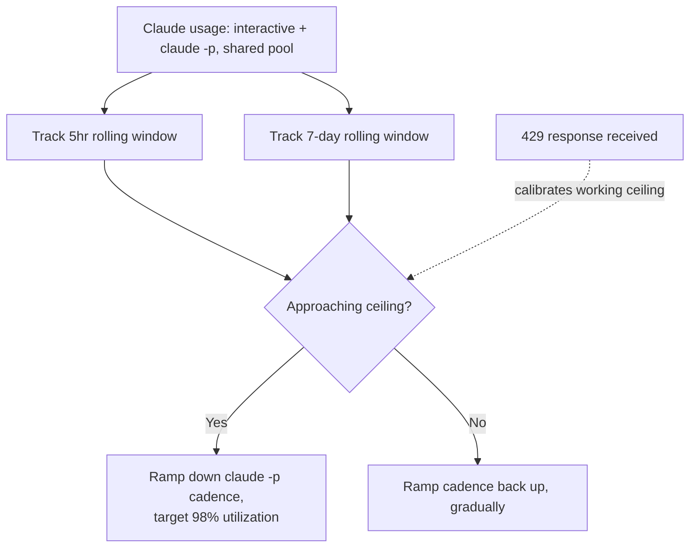

Anthropic will not tell you how many tokens or messages Claude Max 20x actually gives you, and I had to build a throttle for it anyway. I run several personal research projects on background schedules through `claude -p`, unattended fires that call Claude Code from cron and systemd timers while I'm not watching. Those fires draw from the exact same quota as the interactive Claude Code sessions I use to do actual work. If a background job burns the pool at 2pm, my 2:15pm session pays for it. I wanted those jobs to back off automatically as usage climbed, and hand back the room the moment I sat down to work. The problem is that Anthropic gives you nothing to calibrate that against.

## Anthropic publishes a ratio, not a ceiling

The Max plan documentation defines the 20x tier as "20 times more usage per session than the Pro plan," and that's the entire spec. No token count, no message count, no per-window number anywhere in Anthropic's own docs. Everything else is qualitative: usage scales with conversation length, model choice, and effort level, and none of those get a formula. I went looking for a hidden number to hardcode against and confirmed there isn't one, at least not one Anthropic publishes.

That absence isn't a documentation oversight. It's a load-bearing consequence of the ceiling itself moving. Anthropic doubled the 5-hour rate limit for Claude Code on Pro, Max, and seat-based Enterprise plans on 2026-05-06, and removed a peak-hour reduction that had applied to Pro and Max accounts on the same date. Any number I'd baked into a governor before that date would have been wrong the moment it shipped, silently, with no changelog entry pointing at my config file. A governor built against a fixed assumed ceiling is a governor built to go stale.

## One pool, two independent windows, and a hidden sub-cap

The quota itself isn't even one thing to track. Usage across claude.ai, Claude Code, and Claude Desktop draws from a single shared pool. Anthropic states this directly, and it's the fact that makes the whole problem real, because it means a scheduled background fire and an interactive session are actually competing resources, not two separate budgets I could reason about independently.

On top of that shared pool sit two rolling windows that reset on different clocks. A 5-hour session window resets from the timestamp of your first prompt, not wall-clock time, so two people starting a session an hour apart are on different reset schedules even on the same day. A weekly cap sits above that, and it isn't one number either: there's an all-models weekly sub-cap and a separate, narrower Sonnet-only weekly sub-cap layered inside it. A governor that only watches the 5-hour window will run headlong into the weekly Sonnet cap with no warning, because that cap can bind long before the session window ever does.

## The acceleration limit rules out a hard stop-start throttle

The design constraint that changed my approach most came from a practitioner writeup on Claude Code rate limits, not from Anthropic's own docs: Anthropic's rate limiter applies something like an acceleration limit, where a sharp spike in request volume can trigger a 429 even with headroom remaining in the steady-state window. That rules out the simplest version of a governor: check remaining budget, run at full speed until the number hits zero, then hard-stop. A background job snapping from idle to full concurrency the instant a window opens looks exactly like the kind of spike that limiter is built to catch, quota headroom or not. The governor has to ramp cadence down and back up gradually, on both ends, not flip a binary switch.

## What I actually built

The governor is a budget-aware layer that sits on top of the timing logic I already had for scheduling background campaigns, rather than replacing it. It reads from a local SQLite corpus that already tails Claude Code's own transcript files, and from that it computes two rolling figures continuously: weighted token consumption over the trailing 5 hours, and the same over the trailing 7 days, combining interactive and automated usage together since they draw from the same pool. As either figure approaches its ceiling, the governor ramps down the cadence of scheduled `claude -p` fires (not the fires I'm running interactively, only the automated ones), targeting no more than 98% utilization of whatever ceiling it's currently tracking. That reserves roughly 2% of headroom specifically so an interactive session I start doesn't land on an already-exhausted window. As usage clears on either rolling window, cadence ramps back up, on the same gradual curve rather than snapping back to full speed.

Here's the loop the governor actually runs:

The "ceiling it's currently tracking" part is the honest workaround for not having a real number. Since Anthropic doesn't publish one, the governor treats its threshold as calibrated, not assumed: when a `claude -p` fire actually gets rate-limited, Claude's own error response carries a reset timestamp, and the governor parses that as ground truth and adjusts its working ceiling estimate from it. Absent a fresh 429 to calibrate against, it falls back to a conservative default rather than guessing high. It's closer to an adaptive controller reacting to real signals than a static budget checked against a spec sheet, because there is no spec sheet.

I wired the throttle into the two places that actually spend tokens unattended: a scheduled research campaign that fires on a timer, and a document-ingestion pipeline where the lever isn't fire frequency but concurrency: how many ingestion workers run in parallel against the shared quota. Those are shaped differently enough that the governor treats them as separate levers under the same budget rather than one input. I also checked a third scheduled job that looked like a candidate and found it makes no LLM calls at all. It's a deterministic RSS collector, so it was never competing for the quota in the first place, and I excluded it rather than throttling something that didn't need throttling.

## Where I think this could be wrong

The strongest argument against building any of this is that I might have solved a problem that a much dumber approach handles just as well. A purely reactive design (let jobs run at full speed, catch the 429 when it happens, back off with exponential jitter, retry) needs a fraction of the code and doesn't require guessing at a ceiling that keeps moving anyway. I built the proactive version because I wanted to protect interactive sessions from ever seeing a 429 in the first place, not just recover gracefully after one, but I can't prove that protection is worth the complexity it costs. It's possible the reactive fallback alone would have covered 90% of the actual harm.

The number I'm least confident in is the 2% headroom target itself. I picked it because it felt like enough margin without leaving obvious quota on the table, not because I derived it from anything. Since Anthropic doesn't publish the real ceiling, I have no way to check that 2% against ground truth. I can only watch whether interactive sessions still hit limits in practice and adjust after the fact. That's the same calibration-from-observed-429s approach the governor itself uses internally, which means the whole system, including the part of it that's supposed to be doing the calibrating, is ultimately tuned against my own incomplete observations rather than a documented spec. I'm comfortable shipping that. I'm not comfortable calling it settled.
