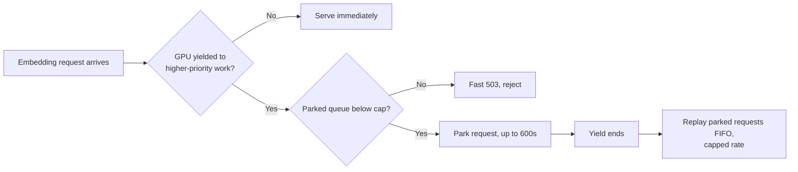

Every embedding server I tested handles a vanished GPU the same way: queue requests until a buffer fills, then reject them. Ollama does this. Text Embeddings Inference (TEI) does this. Infinity and llama.cpp do it too, with different buffer sizes and different error codes but the same shape. None of them pause a request and wait out a short GPU outage. They drop it, either immediately or once a queue limit is hit. I run one GPU at home across gaming, media transcoding, and every local model behind my personal tools, and a broker process decides who gets the card and when. That gap between reject-fast and wait-it-out is what forced me to build the missing layer myself.

## The shared GPU has to change hands, and that's the actual problem

My home GPU serves three tiers of work: interactive chat that needs a response in seconds, batch jobs like embeddings that can tolerate some delay, and long-running jobs that can wait minutes. A broker I run arbitrates access between them. When gaming or a higher-priority job needs the card, the broker yields it away from whatever lower-priority work was using it. That yield might last a few seconds or a couple of minutes. Nothing about the GPU itself failed. It's just occupied elsewhere for a bounded window, and any request caught mid-flight needs to survive that window instead of dying because of it.

## No shipping server treats a busy GPU as temporary

I went looking for prior art before writing anything, and the pattern held across every tool I checked. Ollama's queue (`OLLAMA_MAX_QUEUE`, default 512) holds requests FIFO and returns a 503 once the queue is full. TEI's `--max-concurrent-requests` flag is explicit reject-fast backpressure by design, not an accident of implementation. Infinity and llama.cpp follow the same logic with their own limits. All of them treat a full queue as a hard stop, not something to wait out. That's a reasonable default for a public-facing inference server fielding requests from strangers. It's the wrong default for a private broker that knows exactly why the GPU is unavailable and roughly how long the wait will be.

## LightRAG has no protection of its own, so it has to come from below

I use LightRAG for a knowledge-graph project, and it calls an embedding backend directly with no retry or backpressure logic of its own. Its maintainers' fix for slow embed calls is to set `TIMEOUT=None` and disable the timeout entirely, not to add retries. Three separate open issues track embed failures during batch ingest across different backends, and one of them traces directly to an embed call timing out mid-ingest. None of that gets fixed inside LightRAG. Whatever protection exists has to sit underneath it, in whatever actually talks to the GPU. That's the argument for putting this logic in the broker instead of waiting for any upstream project to add it.

## litellm gets close but solves a different problem

The nearest thing to a real solution I found was litellm's Router, which supports fallback, cooldown, and timeout configuration for embedding calls. It's a genuinely useful primitive, and I'd reach for it if I ever wanted a second embedding backend to fail over to. But its timeout wraps the entire call including retries, not each individual attempt, so it's built for choosing between backends, not for waiting on one backend to come back. I also checked two open-source Ollama proxies, Olla (roughly 260 stars, actively maintained) and ollamaMQ (roughly 114 stars, a fair-share queue proxy written in Rust). Both are solid queueing and failover tools. Neither parks a request through an outage and replays it once the outage ends, which is the specific behavior I needed.

## What I built: park the request instead of rejecting it

The fix lives in the fronting proxy inside my broker, one layer above Ollama. When a yield starts, batch-class synchronous requests, which in practice means embeddings, get parked instead of bounced. The hold has a bound: 600 seconds by default, comfortably under LightRAG's own 1200-second embedding timeout, so a parked request never expires on the caller's side while it's still waiting on mine. There's also a hard ceiling on how many requests can be parked at once. Past that ceiling, the broker returns a fast 503, the same reject-fast principle TEI already applies, just moved up a layer instead of invented from scratch. When the yield ends, parked requests replay in FIFO order with a cap on how many go out at once, so the queue doesn't dump a burst back onto Ollama the instant the GPU returns and cause a second failure right after fixing the first one. I also added Prometheus gauges for parked depth, time spent parked, and replay outcomes, plus an alert rule, because TEI already treats queue depth as something worth exposing as a metric and I didn't see a reason to do less.

Here's the path a request actually takes:

Whether 600 seconds is the right number, I'm not fully sure. It's a good margin under LightRAG's timeout today, but it's tuned to my current yield patterns, and if a yield ever runs long for a reason the broker doesn't already know about, that bound will need to move.

## The CPU fallback I built but haven't turned on

There's an obvious alternative to parking: fall back to a CPU-based embedding model during a yield instead of making anything wait. I have that path built. I'm leaving it off by default. I've seen it misbehave before, unpredictably enough that I don't trust it as a silent fallback, and a LightRAG issue reports CPU-only embedding backends behaving badly specifically inside LightRAG's pipeline, not just running slow. Before I flip that flag on, I want to smoke-test it through LightRAG's actual embedding function, not a standalone request that only proves the model responds to a prompt. A silent, unverified fallback is worse than an honest wait.

## What I still haven't proven

The parking logic passes against requests I send it directly, one at a time. What it hasn't seen yet is a forced yield in the middle of a real embed burst, the exact failure mode this whole thing exists to survive. That test is next: trigger a yield artificially while LightRAG is mid-ingest and confirm zero failures on the caller's side, then fold that scenario into the broker's regular test suite so a future change can't quietly break it. Until that runs, this is a design I believe in, not one I've fully verified under load.

If you're running an embedding server behind a shared GPU at home, this gap is worth checking for directly. Query your server's own queue limit, and ask what happens to a request sitting in that queue when the GPU it's waiting on disappears for reasons the server itself doesn't control. In every server I checked, the answer was the same: it dies. Mine doesn't anymore, but only because I stopped assuming someone else had already solved it.
