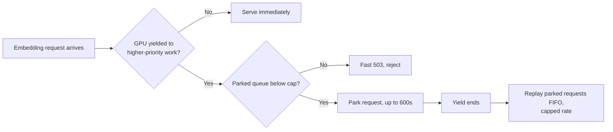

Every embedding server I tested handles a vanished GPU the same way: queue requests until a buffer fills, then reject them. Ollama does this. TEI does this. Infinity and llama.cpp do it too — different buffer sizes, different error codes, same outcome. None of them pause a request and wait out a short outage; they drop it the moment the queue overflows or a limit is hit.

I run one GPU at home across gaming, media transcoding, and every local model behind my personal tools, and a broker process decides who gets the card and when. That gap between reject-fast and wait-it-out is what forced me to build the missing layer myself — nobody else was going to hold the door open while my GPU wandered off to play video games.

## The shared GPU has to change hands, and that's the actual problem

My home GPU juggles three tiers of work:

- **Interactive chat** — needs an answer in seconds.
- **Batch jobs** like embeddings — can tolerate a delay.
- **Long-running jobs** — can wait minutes.

A broker I run arbitrates between them — the same broker whose [phantom-game detection bug got its own post](/blog/debugging-false-positive-gpu-contention-detection/). When gaming or a higher-priority job needs the card, the broker yanks it away from whatever lower-priority work was using it.

That yield might last a few seconds, or a couple of minutes. Nothing about the GPU itself failed — it's just busy elsewhere for a bounded window, and any request caught mid-flight has to survive that window instead of dying because of it.

## No shipping server treats a busy GPU as temporary

I went looking for prior art before writing a line of this. The pattern held across every tool I checked:

- [Ollama's queue](https://docs.ollama.com/faq) (`OLLAMA_MAX_QUEUE`, default 512) holds requests FIFO and returns a 503 once it's full.
- [TEI's `--max-concurrent-requests` flag](https://huggingface.co/docs/text-embeddings-inference/en/cli_arguments) is explicit reject-fast backpressure by design.
- Infinity and llama.cpp follow the same logic with their own limits.

All of them treat a full queue as a hard stop, not something to wait out. That's a reasonable default for a public-facing server fielding requests from strangers. It's the wrong default for a private broker that knows exactly why the GPU is unavailable and roughly how long the wait will be.

## LightRAG has no protection of its own, so it has to come from below

I run LightRAG for a knowledge-graph project ([the same one whose ingestion concurrency I tuned separately](/blog/tuning-lightrag-ingestion-concurrency-against-gemini-rate-limits/)). It talks straight to an embedding backend with no retry logic and no backpressure of its own. The maintainers' fix for slow embed calls is to set `TIMEOUT=None` and disable the timeout entirely — not to add retries.

Three separate open issues track embed failures during batch ingest across different backends, and one traces directly to an embed call timing out mid-ingest. None of that gets fixed inside LightRAG. Whatever protection exists has to sit underneath it, in whatever actually talks to the GPU — the argument for putting this logic in the broker instead of waiting on some upstream project to add it.

## litellm gets close but solves a different problem

The closest thing to a real solution I found was [litellm's Router](https://docs.litellm.ai/docs/routing), which supports fallback, cooldown, and timeout configuration for embedding calls. It's a useful primitive I'd reach for if I ever wanted a second embedding backend to fail over to. But its timeout wraps the entire call including retries, not each individual attempt. It's built for choosing between backends, not for waiting on one backend to come back.

I also checked two open-source Ollama proxies: Olla (roughly 260 stars, actively maintained) and ollamaMQ (roughly 114 stars, a fair-share queue proxy written in Rust). Both are solid queueing and failover tools. Neither parks a request through an outage and replays it once the outage ends — the specific behavior I needed, and nothing I found already did it.

## What I built: park the request instead of rejecting it

The fix lives in the fronting proxy inside my broker, one layer above Ollama. When a yield starts, batch-class synchronous requests — in practice, embeddings — get **parked** instead of bounced:

- **Hold bound**: 600 seconds by default.
- **Parked-queue ceiling**: past it, the broker returns a fast 503 — the same reject-fast principle TEI already applies, just moved up a layer instead of reinvented.
- **Replay**: when the yield ends, parked requests replay in FIFO order with a cap on how many go out at once, so the queue doesn't dump a burst back onto Ollama the instant the GPU returns.
- **Metrics**: Prometheus gauges for parked depth, time spent parked, and replay outcomes, plus an alert rule — TEI already treats queue depth as worth exposing, and I didn't see a reason to do less.

600 seconds is comfortably under LightRAG's own 1200-second embedding timeout, so a parked request never expires on the caller's side while it's still waiting on mine.

The path a request takes once a yield starts:

Whether 600 seconds is the right number, I'm honestly not sure. It's tuned to my current yield patterns — if a yield ever runs long for a reason the broker doesn't already know about, that bound will need to move.

## The CPU fallback I built but haven't turned on

There's an obvious alternative to parking: fall back to a CPU-based embedding model during a yield instead of making anything wait. I have that path built, but I'm leaving it off by default.

I've seen CPU fallback misbehave before — unpredictably enough that I don't trust it as a silent fallback. A LightRAG issue reports CPU-only embedding backends behaving badly specifically inside LightRAG's pipeline, not just running slow.

Before I flip that flag on, I want to smoke-test it through LightRAG's actual embedding function, not a standalone request that only proves the model responds to a prompt. A silent, unverified fallback is worse than an honest wait.

## What I still haven't proven

The parking logic passes against requests I send it directly, one at a time. What it hasn't seen yet is a forced yield in the middle of a real embed burst — the exact failure mode this whole thing exists to survive. That test is next:

1. Trigger a yield artificially while LightRAG is mid-ingest.
2. Confirm zero failures on the caller's side.
3. Fold that scenario into the broker's regular test suite so a future change can't quietly break it.

Until that runs, this is a design I believe in, not one I've fully verified under load.

If you're running an embedding server behind a shared GPU at home, this gap is worth checking for directly. Query your server's own queue limit, and ask what happens to a request sitting in that queue when the GPU it's waiting on disappears for reasons the server itself doesn't control. In every server I checked, the answer was the same: it dies.

Mine doesn't anymore. The GPU still wanders off to game whenever gaming wins the tiebreak, but now a request just waits by the door instead of dying on the porch — because I stopped assuming someone else had already solved it.
