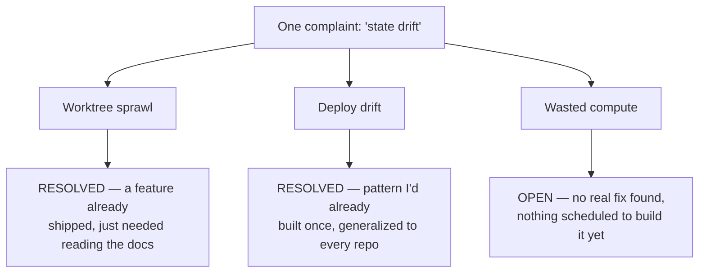

Running four or five Claude Code agents at once across separate repos felt like one problem: things drifting out of state while I wasn't watching. It turned out to be three separate failure modes wearing one name, and each one needed a different fix. Worktree sprawl (leftover git checkouts an agent session opened and nobody closed) was mostly a feature I hadn't turned on, not a missing tool. Deploy drift (a running service that no longer matches what an agent thought it built) was a problem I'd already solved once, for one project, and just needed to generalize. Wasted compute across my machines is the one piece nothing solved, and it's still open. Treating all three as one complaint is exactly what kept me from seeing that only one of them was actually about drift.

Here's where each of the three actually landed:

## Worktree sprawl turned out to be a feature nobody had switched on

I run Claude Code as several parallel agents, each working a different repo or branch, and each one needs its own working directory so two agents don't stomp on the same uncommitted edits. Git's answer to that is a worktree: a second working directory attached to the same repository, checked out on its own branch, addable and removable independently of the main clone. The complaint that started this whole investigation was plain. I kept finding worktrees on disk that some agent session had opened and nobody, including me, had closed.

The research sweep turned up something I hadn't clocked: Claude Code already ships a lifecycle for this, and most of it just needs turning on rather than replacing. It auto-sweeps worktrees it created for subagents and background sessions once they clear a configurable age, but only if they're clean, with no uncommitted changes and no unpushed commits. Anything opened with an explicit `--worktree` flag, or created mid-session with the `EnterWorktree` tool, is permanently exempt from that sweep. The documentation says so directly: it never removes a worktree you create that way. That distinction explains most of what I'd been seeing. My deliberate multi-agent sessions, the ones I open on purpose rather than the throwaway subagent kind, were never going to get swept, because the sweep was never built to touch them.

## Deploy drift is a different bug wearing the same complaint

Deploy drift means a running service no longer matches what the agent that built it believes is deployed: config edited by hand after the fact, a container that never picked up the latest image, a service pointed at a stale checkout. This isn't a worktree problem at all. It's a gap between git state and live state, and no worktree cleanup script reaches it. I'd already closed that gap once, for one home-lab service, with a script that checks the deploy target after every push and diffs what's actually running against what git says should be running, backed by a written rule that every service needs the same coverage. The pattern the wider search turned up, a scheduled check that shells out over SSH to compare live state against the repo, was structurally the same thing I'd already built. The gap wasn't a missing tool. It was that the pattern only ran against one project instead of every project with something deployed.

Heavier options exist, like a continuous-reconciliation controller that diffs live cluster state against a git manifest on every change. That shape is built for orchestrating containers across a cluster, and my footprint is a handful of systemd services and Docker Compose stacks on two machines. Adopting that would mean running infrastructure to manage infrastructure I don't have. The actual fix is unglamorous: copy the pattern I already trust to the rest of the repos that deploy something.

## Wasted compute is the one nobody has actually solved

Compute utilization across my machines is where the search came back empty-handed. Agents sit idle on one box while the other has spare capacity, and nothing I found actually schedules work across that gap the way a real fleet scheduler would. The closest candidate was a small, early open-source CLI aimed at exactly this, routing work and judging reliability across agent runtimes, but it's unverified: too new and too thin on real adoption to trust with anything that matters. I'm calling that an honest gap, not a wait-and-see item with nothing to do. If I want it solved, I have to build a thin version myself, and I haven't started.

## A follow-up audit checked whether the fix actually held

Two weeks after landing on that plan, I went back and audited every repo on both machines against the documented worktree lifecycle instead of taking the research sweep's conclusion on faith. The native `EnterWorktree`/`ExitWorktree` lifecycle, Claude Code's own tools for opening and closing a worktree mid-session, works correctly in exactly the one workflow I built for it, and doesn't exist anywhere else yet. That workflow opens a worktree at the start of a run and closes it right after a successful merge. Every other repo on the Mac (roughly two dozen of them) and every repo on the desktop, which is a deploy target rather than somewhere agents run, has never had a worktree at all. There's no adoption gap to close in those repos, because there's no worktree activity in them to sweep in the first place.

Total inventory across both machines came to four worktrees. One was a live session, locked and actively in use, correctly left alone. Two belonged to a separate build-cache tool used by another skill in my pipeline, not Claude Code's own lifecycle, which is a different kind of accumulation than agent sprawl. One was a genuine dead worktree: a merged, clean, three-day-old checkout that should have been removed and wasn't.

That fourth one is the interesting case, because it wasn't a bug. My own workflow documents a fallback rule for exactly this situation: if a run fails partway through after the merge already succeeded, leave the worktree on disk and say so in the final report instead of silently deleting work mid-failure. The dead worktree on the Mac is that rule firing exactly as designed, on a run where some later phase (hardening, review, deploy, or verification) stopped short after the merge had already landed. The lifecycle didn't fail. It did exactly what I told it to do when something breaks downstream, which is preserve state over convenience. I understand that failure now; I haven't fixed the part where nothing reminds me to go check for it after a run stops early. That's still a manual habit, not automation.

Of the three failure modes, one turned out to already be handled by a feature I hadn't read the docs on. One is a pattern I'd already proved, just not everywhere it needs to run. The third has no real answer yet, and I'm not going to dress up a small unverified GitHub repo as a fix. Three problems, three different states of done. Calling all of it "state drift" on day one is exactly what stopped me from seeing that only one of the three was actually a drift problem at all.
