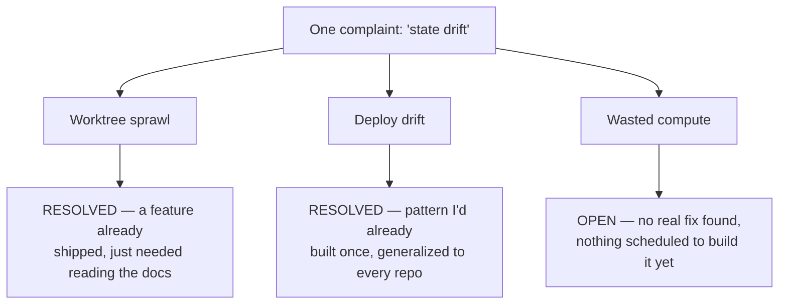

Three failure modes were hiding behind one name, and only one of them was actually about drift. I run four or five Claude Code agents at once, each in its own repo, and for months every mess that came out of it got filed under the same complaint: things drifting out of state while I wasn't watching. Pulled apart, the three landed in very different places:

- **Worktree sprawl** — leftover git checkouts an agent session opened and nobody closed. Turned out to be mostly a feature I hadn't turned on, not a missing tool. Resolved.
- **Deploy drift** — a running service that no longer matches what an agent thought it built. A problem I'd already solved once, for one project, and just needed generalizing. Resolved.
- **Wasted compute** — idle capacity across my machines. Still open; nothing solved it.

Calling all three "state drift" was the mistake — it's the reason it took this long to notice only one of them actually was about drift.

## Worktree sprawl turned out to be a feature nobody had switched on

Worktree sprawl looked like a missing tool, but it wasn't. I run Claude Code as several parallel agents, each working a different repo or branch, and each one needs its own working directory so two agents don't stomp on the same uncommitted edits. ([What that style of agent use costs is its own story](/blog/what-a-364-dollar-claude-code-session-taught-me-about-agent-hygiene/).) [Git's answer to that is a worktree](https://git-scm.com/docs/git-worktree): a second working directory attached to the same repository, checked out on its own branch, addable and removable independently of the main clone.

The complaint that started this investigation was plain: I kept finding worktrees on disk that some agent session had opened, and nobody, including me, had closed.

[Claude Code already ships a worktree lifecycle](https://code.claude.com/docs/en/worktrees), which the research sweep turned up and I hadn't clocked before. Most of it just needed turning on, not replacing:

- It **auto-sweeps** worktrees created for subagents and background sessions once they clear a configurable age — but only if they're clean: no uncommitted changes, no unpushed commits.
- Anything opened with an explicit `--worktree` flag is **exempt from that sweep entirely**; the documentation says directly it never removes a worktree created that way.
- Worktrees opened mid-session with the `EnterWorktree` tool only get cleaned up on a clean session exit, so a session that dies partway leaves them behind.

That distinction explained most of what I'd been seeing. My deliberate multi-agent sessions, opened on purpose rather than the throwaway subagent kind, were never going to get swept — the sweep was never built to touch them.

## Deploy drift is a different bug wearing the same complaint

Deploy drift means a running service no longer matches what the agent that built it believes is deployed: config edited by hand after the fact, a container that never picked up the latest image, a service pointed at a stale checkout. That's not a worktree problem. It's a gap between git state and live state, and no worktree cleanup script reaches it.

I'd already closed that gap once, for one home-lab service, with a script that checks the deploy target after every push and diffs what's actually running against what git says should be running, backed by a written rule that every service needs the same coverage. The pattern the wider search turned up, a scheduled check that shells out over SSH to compare live state against the repo, was structurally the thing I'd already built.

The gap wasn't a missing tool. It was that the pattern only ran against one project instead of **every project with something deployed**.

Heavier options exist — a continuous-reconciliation controller built for orchestrating containers across a cluster, diffing live state against a git manifest on every change. My footprint is a handful of systemd services and Docker Compose stacks on two machines; adopting that would mean running infrastructure to manage infrastructure I don't have. The actual fix is unglamorous: copy the pattern I already trust to the rest of the repos that deploy something.

## Wasted compute is the one nobody has actually solved

Compute utilization across my machines is where the search came back empty-handed. Agents sit idle on one box while the other has spare capacity, and nothing I found actually schedules work across that gap the way a real fleet scheduler would.

The closest candidate was a small, early open-source CLI built for exactly this: routing work and judging reliability across agent runtimes.

It's unverified — too new and too thin on real adoption to trust with anything that matters.

That's an honest gap, not a wait-and-see item. If I want it solved, I have to build a thin version myself, and I haven't started.

## A follow-up audit checked whether the fix actually held

The audit held up: two weeks after landing on that plan, I went back and checked every repo on both machines against the documented worktree lifecycle instead of taking the research sweep's conclusion on faith. The native `EnterWorktree`/`ExitWorktree` lifecycle, Claude Code's own tools for opening and closing a worktree mid-session, works correctly in exactly the one workflow I built for it. It doesn't exist anywhere else yet. That workflow opens a worktree at the start of a run and closes it right after a successful merge.

Every other repo on the Mac, roughly two dozen of them, and every repo on the desktop (a deploy target, not somewhere agents run) has never had a worktree at all. There's no adoption gap in those repos — no worktree activity to sweep in the first place.

Total inventory across both machines: four worktrees.

- One was a live session, locked and actively in use — correctly left alone.
- Two belonged to a separate build-cache tool used by another skill in my pipeline, not Claude Code's own lifecycle — a different kind of accumulation than agent sprawl.
- One was a genuine dead worktree: a merged, clean, three-day-old checkout that should have been removed and wasn't.

That fourth one is the interesting case, because it wasn't a bug. My own workflow documents a fallback rule for exactly this: if a run fails partway through after the merge already succeeded, leave the worktree on disk and say so in the final report instead of silently deleting work mid-failure. The dead worktree on the Mac is that rule firing exactly as designed — some later phase (hardening, review, deploy, or verification) stopped short after the merge had already landed.

It did exactly what I told it to do when something breaks downstream: **preserve state over convenience**. But I still haven't fixed the part where nothing reminds me to go check for it after a run stops early — that's a manual habit, not automation yet.

One of the three was already solved by a feature I hadn't read the docs on. One was a pattern I'd already proven, just needed pointing at everything. The third still has no real fix — I'm not dressing up a thin, unverified GitHub repo and calling it done.

But "state drift" was never a diagnosis — it was a name I gave three problems so I wouldn't have to look at them separately. A stray worktree, a stale container, and an idle box are not the same bug, and treating them as one is what kept me from fixing any of them faster.
