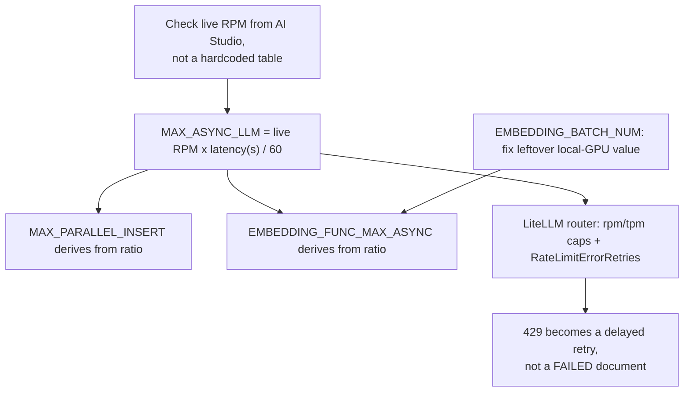

Feeding a few hundred books into LightRAG through Gemini taught me that concurrency tuning is the wrong first lever, and that the rate-limit table you'd normally tune it against doesn't exist anymore anyway. I run a personal knowledge-graph project that ingests close to a thousand book-length documents through [LightRAG](https://github.com/HKUDS/LightRAG) (HKUDS), using Gemini for entity extraction and embeddings behind a LiteLLM proxy. The corpus is entity-dense enough that the LLM merge phase dominates ingestion time.

Early runs kept marking documents FAILED, no obvious cause in the logs, no warning, just gone.

This post is what I found chasing that down: the actual concurrency knobs, why Gemini's rate limits are now a moving target, and the one setting that mattered more than any of it.

## A 429 in LightRAG doesn't retry, it fails the document

The failure mode is quiet, and that's what makes it dangerous. When a Gemini call returns HTTP 429, LightRAG doesn't queue the document and try again later. It **marks the document FAILED and moves on**. No crash, no page, nothing — unless you're watching the per-document status table, you won't notice until the corpus finishes and a chunk of it is just missing from the graph.

That's exactly what happened on my first real run against this corpus: documents dropped out of the pipeline looking, from a distance, like success.

## LightRAG's own tuning knobs assume a ratio, not a rate

Four environment variables govern ingestion concurrency in LightRAG. I ended up trusting the source over the docs prose to actually understand them:

- `MAX_ASYNC_LLM` — concurrent LLM calls (extraction, merge, keyword generation, answer synthesis). Default 4.
- `MAX_PARALLEL_INSERT` — documents processed in parallel. Default 3; [LightRAG's own `env.example`](https://github.com/HKUDS/LightRAG/blob/main/env.example) recommends keeping it near `MAX_ASYNC_LLM / 3`.
- `EMBEDDING_FUNC_MAX_ASYNC` — concurrent embedding calls, on a separate pool from the LLM pool. Default 8.
- `EMBEDDING_BATCH_NUM` — chunks bundled into one embedding request. Default 10.

The project's documented high-throughput profile is `MAX_ASYNC_LLM=8, MAX_PARALLEL_INSERT=3, EMBEDDING_FUNC_MAX_ASYNC=16, EMBEDDING_BATCH_NUM=32`, and a real-world test in [LightRAG issue #2264](https://github.com/HKUDS/LightRAG/issues/2264) using a similar profile took ingestion from 7 hours 8 minutes down to 1 hour 45 minutes on the same corpus — a legitimate 4x.

But that ratio only describes how LightRAG should divide work internally. **It says nothing about how much total work your Gemini project is allowed to accept per minute** — and that ceiling is the one that actually throws the 429s.

## Gemini's rate limit isn't a table you can hardcode anymore

Google stopped publishing a static per-model rate-limit table as of July 2026. [The Gemini API rate-limit docs](https://ai.google.dev/gemini-api/docs/rate-limits) now say limits depend on your project's usage tier and are "not guaranteed," which in practice means you read the live number out of AI Studio for your specific project before you tune anything.

That was a real adjustment for me: I'd been treating rate limits like a spec you design against once. They're now closer to a runtime condition you check on the way in. Free and early-tier flash access is often in the 10-15 RPM range, which makes `MAX_ASYNC_LLM=8` from the "official" profile actively dangerous rather than aspirational.

There's also a second, independent limiter on paid tiers: a spend-based burst cap over a rolling 10-minute window, separate from the RPM/TPM ceiling.

You can sit well under your requests-per-minute limit and still get 429'd by the burst cap.

The derivation that actually holds up: set `MAX_ASYNC_LLM` to roughly your live RPM times average call latency in seconds, divided by 60. Flash's latency runs 1-3 seconds per call, so a 10 RPM tier caps you at 2-4 concurrent calls, while a paid tier with thousands of RPM lets you approach the documented profile.

Everything else — insert parallelism, embedding pool size — derives from that number, not the other way around. Tune to the ratio first and you're tuning against a number that doesn't reflect your actual ceiling.

Here's the derivation chain end to end, tuning knobs plus the absorb layer:

## The single highest-leverage fix wasn't concurrency at all

My container had `EMBEDDING_BATCH_NUM` set to 2, a leftover from [an earlier era when embeddings ran on a local GPU model](/blog/nine-fixes-lightrag-embedding-crash-one-afternoon/) instead of Gemini's hosted embedding API. Against a local model, batch size barely matters — you're not paying per request.

Against a rate-limited cloud API, batch size 2 versus the recommended 32 means sixteen times more embedding requests for the exact same corpus, and sixteen times more pressure on the embedding RPM ceiling for zero benefit. **Fixing that one line did more for my 429 rate than any concurrency change did**, with no downside: same total work, dramatically fewer requests.

If you're moving a LightRAG setup from a local embedder to a cloud one, check this value before you touch anything else.

[LightRAG issue #1648](https://github.com/HKUDS/LightRAG/issues/1648) is a useful reality check here too: someone running a 50,000-document ingest with a conservative embedding concurrency of 5 still hit 429s on the embedding service. Low concurrency lowers the odds of hitting a ceiling — it doesn't eliminate them, since a single misconfigured batch size can undo the benefit entirely.

## The proxy layer should absorb overshoot, not let it fail documents

Concurrency limits are a best-effort guess at the ceiling, and best-effort guesses are sometimes wrong. The fix isn't guessing more precisely — it's making the failure mode survivable when the guess is wrong.

The same absorb-don't-fail principle drove [the request-parking layer I built for my local embedding broker](/blog/surviving-a-gpu-yield-window-embedding-servers/); here the absorbing layer is the proxy. [LiteLLM's router](https://docs.litellm.ai/docs/routing) supports `rpm` and `tpm` caps per model in its `model_list`, and if you don't set `max_parallel_requests` explicitly it derives concurrency from those numbers automatically.

It also supports a `retry_policy` with a dedicated `RateLimitErrorRetries` count, separate from timeout or server-error retries — **that's the setting that actually matters here**: a 429 that hits LiteLLM with that policy configured gets retried with backoff instead of surfacing as an error LightRAG has to interpret.

Set those caps to your project's real live limits, add the retry policy, and a burst that exceeds your ceiling turns into a delayed request instead of a failed document. Skip that layer and every concurrency tweak is a bet that you never overshoot. Eventually you will.

Running LiteLLM with multiple worker processes? rpm/tpm counters need to be backed by Redis to be shared across workers — otherwise each worker enforces the cap independently, and your real aggregate concurrency against Gemini is a multiple of what you configured.

I haven't needed multi-worker LiteLLM for this corpus size, so I can't speak to how much that matters in practice, but it's a documented gap worth knowing about before you scale up.

## What I'd push back on in my own conclusion

The uncomfortable part of this whole exercise: the "optimal ratio" LightRAG documents is close to useless without knowing your live rate limit first, which makes it feel like the wrong place to have started. I could argue I wasted time reading `env.example` line by line when the actual fix was one line in a docker-compose file.

I don't think that's quite right, though. The ratio still matters once you know your ceiling — it tells you how to divide a fixed budget of concurrent calls between insertion and embedding, rather than just picking a number.

What I'm genuinely unsure about is whether the entity-merge phase's partial serialization (the same GitHub issue that got the 4x speedup also reported the GPU sitting underutilized during ingestion) is a bigger long-term bottleneck than rate limits for a corpus this size. I haven't run the numbers on a from-scratch full reingest with the fixed batch size and proxy guardrails in place. That's a real open question, not a settled one.

If you're running LightRAG against any rate-limited cloud LLM, check three things before you touch a single concurrency variable:

- Your embedding batch size
- Your provider's live rate limit for your actual tier
- Whether your proxy retries 429s or just lets them through

Concurrency tuning is the part that feels like engineering. Getting those three right is the part that actually keeps documents from quietly turning FAILED while you're not looking.
