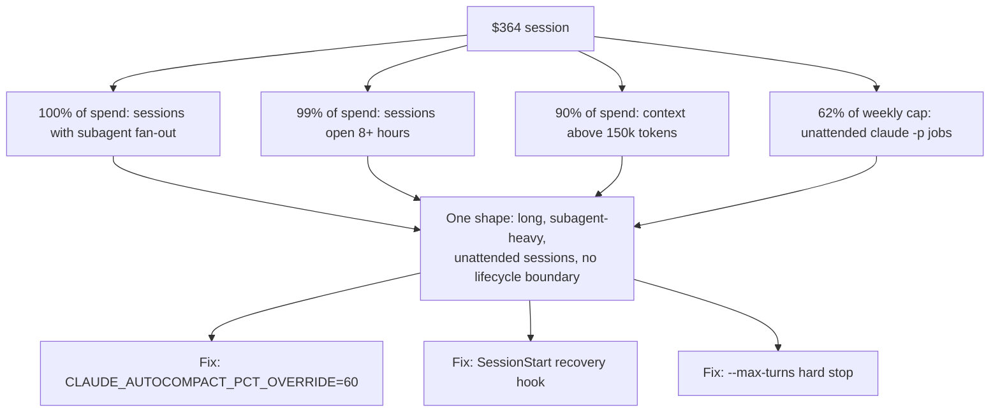

A single Claude Code session in my home lab cost $364. I found it on my own `/usage` report, not from a billing alert, and it was enough to make me stop and read the full week behind it instead of writing it off as one bad run.

The breakdown behind that number told a clean story. Every dollar of that week's spend, 100 percent of it, came from sessions that had spawned subagents, meaning the main session had delegated work to separate Claude instances running in parallel rather than doing everything itself. Ninety-nine percent came from sessions that ran longer than eight hours straight. Ninety percent of spend happened while the session's context window, the running token budget that holds the full conversation history, sat above 150,000 tokens. And by the middle of that week, continuous `claude -p` jobs, Claude Code's non-interactive mode for scripted and scheduled work, firing unattended on my desktop had already burned 62 percent of my weekly usage cap. Four numbers, one shape: long, subagent-heavy, unattended sessions running with no lifecycle boundary at all.

Here's how the four numbers converged into one diagnosis, and the fixes that came out of it:

## Long sessions cost more than caching can offset

Claude Code resends the full conversation history with every turn. Message 201 in an eight-hour session costs as much input processing as messages 1 through 200 combined, before any caching discount applies. Prompt caching cuts the price of resending unchanged prefix content. But it discounts the resend. It doesn't remove it. A session that stays open for eight or more hours keeps paying that growing tax on every single turn, and my own numbers show it: 99 percent of the week's spend sat in sessions that never closed. The fix [Anthropic documents in the Claude Code cost guide](https://code.claude.com/docs/en/costs) is blunt and manual: run `/compact` proactively around 60 percent context fill instead of waiting until the window is nearly full, and run `/clear` between unrelated phases of work rather than letting one session drift across a full day. Manual is fine for a person sitting at a terminal. It does nothing for a job that fires at 3am with nobody watching.

## Subagents multiply spend before anyone notices

Fanning work out to subagents is supposed to save tokens. Each subagent's verbose output stays in its own context, and only a summary comes back to the parent. In practice, a pipeline that spawns seven or more subagents per run, planning coordination between them, runs at roughly seven times the cost of a single standard session. That number matched what I saw: sessions with any subagent fan-out accounted for the entire week's spend. But here's the part I'd missed: subagents inherit the parent session's model by default. A subagent running a mechanical task, checking test coverage, scaffolding a file, grepping logs for a pattern, gets billed at the same rate as one doing real design judgment, unless something explicitly tells it not to. [Claude Code's subagent docs expose that override three ways](https://code.claude.com/docs/en/sub-agents): a `model:` field in the subagent's own frontmatter, an invocation parameter, or a `CLAUDE_CODE_SUBAGENT_MODEL` environment variable that downgrades every subagent in a session at once. None of my heavier pipelines were using any of the three.

## Unattended jobs share the interactive cap, and I'd budgeted like they didn't

On 2026-06-15, [Anthropic paused a planned change to Agent SDK billing](https://support.claude.com/en/articles/15036540-use-the-claude-agent-sdk-with-your-claude-plan) that would have moved headless `claude -p` and Agent SDK calls onto their own separate credit pool. The pause settled the question the other way: programmatic usage draws from the same weekly subscription cap as interactive sessions, and it stays there. I had been scheduling those jobs as if that separation had already happened, treating a job firing every thirty minutes around the clock as close to a free lever. It isn't one. Every one of those fires competes directly with my own interactive coding time for the same weekly ceiling, and that's the direct explanation for 62 percent of the cap gone by midweek. A continuous loop with no turn limit and no session boundary kept spending against the same budget my keyboard time needed, and nothing in the loop was watching the total. The [cadence governor I later built for those unattended fires](/blog/self-throttling-claude-max-without-a-published-ceiling/) exists because of exactly this competition.

## Headless jobs already get half the fix for free

Once the diagnosis was clear, the question became how to enforce session hygiene on jobs that run with no human present to type `/clear` or `/compact`. The useful discovery here is that `claude -p` is stateless per invocation unless you explicitly pass `--continue` or `--resume`. Every scheduled fire already starts with a clean context window by default, which is the programmatic equivalent of running `/clear` before every cycle. The pattern that makes this work is phase-per-process: one `claude -p` call per unit of work, with state persisted to files or a database on disk rather than kept in conversation memory. My own automation pipelines already write their working state that way, mostly because on-disk state is easier to debug than a live session, and it turns out that habit already satisfies the fresh-context half of the fix. I built it for a different reason and got session hygiene as a side effect.

## Two small mechanisms close the rest of the gap

The remaining gaps needed deliberate, not incidental, fixes.

The first is compaction. [`CLAUDE_AUTOCOMPACT_PCT_OVERRIDE`](https://code.claude.com/docs/en/env-vars) is an environment variable, taking a value from 1 to 100, that sets the context-fill percentage at which auto-compaction fires. Setting it to 60 turns the "compact at 60 percent, not 95 percent" guidance from a habit a person has to remember into a rule the process enforces on itself, whether or not anyone is watching that particular run.

The second is recovery. A session that gets cleared or auto-compacted loses whatever informal context it was tracking, and a scripted job has no one to re-explain the situation to it afterward. [Claude Code's `SessionStart` hook](https://code.claude.com/docs/en/hooks) fires with a `source` field that reports whether the session is starting fresh, resuming, or recovering from a clear or compact event, and anything the hook's command prints to stdout gets injected directly into the new context. A short hook that matches on `clear` or `compact` and echoes a pointer back at the run's on-disk checkpoint state makes every compaction self-healing: the session picks itself back up without a person there to remind it where it left off.

Two smaller rails round this out. `--resume`, using a session ID captured from a prior run's `--output-format json` output, is the reliable way to chain phases that genuinely need continuity; `--continue` is documented as unreliable inside scripted loops and can silently start a new session instead of resuming the old one. And [`--max-turns`](https://code.claude.com/docs/en/cli-reference) on every headless invocation is the hard stop that keeps a misbehaving loop from running past its budget even if the compaction and recovery hooks are working exactly as intended.

## What I still don't know

I set `CLAUDE_AUTOCOMPACT_PCT_OVERRIDE=60` and wrote the `SessionStart` re-seed hook the same week I found the $364 session, and I added `--max-turns` to the campaign fires that were running unbounded. What I don't have yet is a second week of `/usage` data that proves any of it actually moved the number down. The four-number diagnosis was solid; it came straight off measured usage. But the fix is still an inference from Claude Code's documented mechanics, not a before-and-after I've verified with my own eyes. It's entirely possible the compaction override behaves differently than the docs describe, or that the hook injects less useful context than I think it does, and I won't know until a comparably heavy week passes and I pull `/usage` again. Until then, this is the right fix on paper, applied, and unconfirmed.
