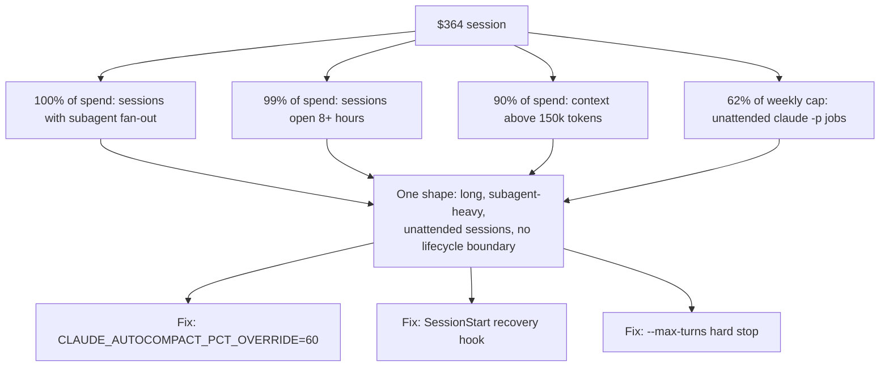

You can write great code with agents. I believe that now. But they're pretty bad on their own without manual review at the beginning and end of every initiative. That's what a $364 Claude Code session taught me. I found the number on a quiet Sunday morning, checking on the automated processes I'd kicked off the night before.

## Four Numbers Pointed to One Shape: Long, Unattended, Subagent-Heavy Sessions

The week behind that number broke down the same way every time:

- **100%** of the spend came from sessions that had spawned subagents: the main session delegating to separate Claude instances running in parallel.
- **99%** came from sessions that ran longer than eight hours straight.
- **90%** happened while context sat above 150,000 tokens.
- **62%** of my weekly cap was already burned by the middle of that week, from `claude -p` jobs firing unattended on my desktop.

One shape: long, subagent-heavy, unattended sessions, with no lifecycle boundary at all.

## The Actual Stakes: Passive Income and My Own Name on the Code

I don't want to spend a lot of money doing this. The goal is passive income streams for my family, built on the algo work these sessions support. I also care about the codebase and the architecture being as good as possible — I'm a software engineer, and this kind of thing matters to me. It bothers me having something run that I don't understand. This sort of stuff is supposed to represent me, since I'm staking my identity on being a professional computer toucher.

## Subagents Inherit the Parent's Model Unless Told Otherwise

One gap in the pipeline: subagents inherit the parent session's model by default. A subagent doing mechanical work, checking test coverage, grepping logs, gets billed at the same rate as one doing real design judgment, unless something tells it not to. [Claude Code's subagent docs](https://code.claude.com/docs/en/sub-agents) expose three ways to override it: a `model:` field in the subagent's own frontmatter, an invocation parameter, or a `CLAUDE_CODE_SUBAGENT_MODEL` environment variable that downgrades every subagent in a session at once. None of my heavier pipelines were using any of the three.

## Unattended Jobs Draw From the Same Cap as My Own Keyboard Time

Programmatic usage draws from the same weekly subscription cap as interactive sessions. On 2026-06-15, [Anthropic paused a planned change to Agent SDK billing](https://support.claude.com/en/articles/15036540-use-the-claude-agent-sdk-with-your-claude-plan) that would have split headless `claude -p` and Agent SDK calls onto their own credit pool. The pause settled it the other way. I'd been scheduling jobs as if the separation had already happened. It hadn't. The [cadence governor I built for those unattended fires](/blog/self-throttling-claude-max-without-a-published-ceiling/) exists because of that competition, and because, as I put it after this session, "token/performance discipline must be BAKED INTO the workflows, not left to habit."

## Three Fixes Went in the Same Week I Found the Number

Three fixes went in: [`CLAUDE_AUTOCOMPACT_PCT_OVERRIDE=60`](https://code.claude.com/docs/en/env-vars), an environment variable that sets the context-fill percentage where auto-compaction fires. Setting it to 60 makes it a rule instead of a habit I have to remember. A [`SessionStart` hook](https://code.claude.com/docs/en/hooks) that fires on `clear` or `compact` and re-injects the run's on-disk state, so a cleared session recovers instead of losing the thread. And a hard [`--max-turns`](https://code.claude.com/docs/en/cli-reference) stop on every headless invocation, so a misbehaving loop can't run past budget even if the other two are working.

## I Still Don't Have a Grip on the Whole Thing

I still don't really have a good grip on my entire codebase, the work, or the money I'm spending on it. I'm treating it as a learning process: proposing a hypothesis and collecting data from the experiment. Every positive is an opportunity to refine the pipeline and make it even better.
