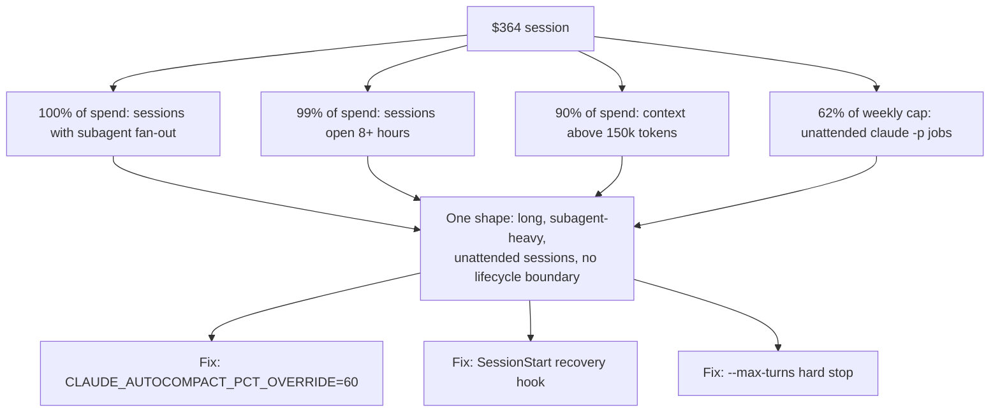

A single Claude Code session in my home lab cost $364. I found it on my own `/usage` report, not from a billing alert, and it was enough to make me stop and read the full week behind it instead of writing it off as one bad run.

The breakdown behind that number told a clean story:

- **100%** of spend came from sessions that had spawned subagents — the main session delegating work to separate Claude instances running in parallel instead of doing everything itself.
- **99%** came from sessions that ran longer than eight hours straight.
- **90%** of spend happened while the session's context window (the running token budget holding the full conversation history) sat above 150,000 tokens.
- **62%** of my weekly usage cap was already burned by the middle of that week, by continuous `claude -p` jobs — Claude Code's non-interactive mode for scripted, scheduled work — firing unattended on my desktop.

Four numbers, one shape: long, subagent-heavy, unattended sessions running with no lifecycle boundary at all.

Here's how the four numbers converged into one diagnosis, and the fixes that came out of it:

## Long sessions cost more than caching can offset

Claude Code resends the full conversation history with every turn. Message 201 in an eight-hour session costs as much input processing as messages 1 through 200 combined, before any caching discount applies. Prompt caching cuts the price of resending unchanged prefix content — it discounts the resend, it doesn't remove it.

A session that stays open for eight or more hours keeps paying that growing tax on every turn. My own numbers show it: **99 percent of the week's spend sat in sessions that never closed.**

The fix [Anthropic documents in the Claude Code cost guide](https://code.claude.com/docs/en/costs) is blunt, and it's manual: run `/compact` proactively around 60 percent context fill instead of waiting until the window is nearly full, and run `/clear` between unrelated phases of work instead of letting one session drift across a full day. That's fine for a person at a terminal. It does nothing for a job that fires at 3am with nobody watching.

## Subagents multiply spend before anyone notices

Fanning work out to subagents is supposed to save tokens — each subagent's verbose output stays in its own context, and only a summary comes back to the parent. In practice, a pipeline that spawns seven or more subagents per run, plus the coordination between them, runs at roughly seven times the cost of a single standard session. That matched what I saw: **sessions with any subagent fan-out accounted for the entire week's spend.**

Here's the part I'd missed: subagents inherit the parent session's model by default. A subagent doing mechanical work — checking test coverage, scaffolding a file, grepping logs for a pattern — gets billed at the same rate as one doing real design judgment, unless something explicitly tells it not to.

[Claude Code's subagent docs](https://code.claude.com/docs/en/sub-agents) expose that override three ways:

- a `model:` field in the subagent's own frontmatter
- an invocation parameter
- a `CLAUDE_CODE_SUBAGENT_MODEL` environment variable that downgrades every subagent in a session at once

None of my heavier pipelines were using any of the three.

## Unattended jobs share the interactive cap, and I'd budgeted like they didn't

On 2026-06-15, [Anthropic paused a planned change to Agent SDK billing](https://support.claude.com/en/articles/15036540-use-the-claude-agent-sdk-with-your-claude-plan) that would have moved headless `claude -p` and Agent SDK calls onto their own separate credit pool. The pause settled the question the other way: **programmatic usage draws from the same weekly subscription cap as interactive sessions**, and it stays there.

I'd been scheduling jobs as if that separation had already happened — treating a fire every thirty minutes, around the clock, as close to a free lever. It isn't. Every fire competes directly with my own interactive coding time for the same weekly ceiling.

62 percent of my weekly usage cap was already gone by midweek — burned by a continuous loop with no turn limit and no session boundary, spending against the same budget my own keyboard time needed.

The [cadence governor I later built for those unattended fires](/blog/self-throttling-claude-max-without-a-published-ceiling/) exists because of exactly this competition.

## Headless jobs already get half the fix for free

Once the diagnosis was clear, the question became how to enforce session hygiene on jobs with no human present to type `/clear` or `/compact`. The useful discovery: **`claude -p` is stateless per invocation** unless you explicitly pass `--continue` or `--resume`. Every scheduled fire already starts with a clean context window by default — the programmatic equivalent of running `/clear` before every cycle.

The pattern that makes this work is phase-per-process: one `claude -p` call per unit of work, with state persisted to files or a database on disk instead of kept in conversation memory.

My own automation pipelines already write state that way, mostly because on-disk state is easier to debug than a live session. That habit already satisfied the fresh-context half of the fix. I built it for a different reason and got session hygiene as a side effect.

## Two small mechanisms close the rest of the gap

The remaining gaps needed deliberate fixes, not incidental ones:

- **Compaction.** [`CLAUDE_AUTOCOMPACT_PCT_OVERRIDE`](https://code.claude.com/docs/en/env-vars) is an environment variable (1–100) that sets the context-fill percentage where auto-compaction fires. Setting it to 60 turns "compact at 60 percent, not 95" from a habit a person has to remember into a rule the process enforces on itself.
- **Recovery.** A session that gets cleared or auto-compacted loses whatever informal context it was tracking, and a scripted job has no one to re-explain the situation to it afterward. [Claude Code's `SessionStart` hook](https://code.claude.com/docs/en/hooks) fires with a `source` field reporting whether the session is starting fresh, resuming, or recovering from a clear or compact event, and anything it prints to stdout gets injected directly into the new context. A hook that matches on `clear` or `compact` and echoes a pointer back at the run's on-disk checkpoint state makes every compaction self-healing.
- **`--resume` vs. `--continue`.** `--resume`, using a session ID captured from a prior run's `--output-format json` output, is the reliable way to chain phases that genuinely need continuity. `--continue` is documented as unreliable inside scripted loops and can silently start a new session instead of resuming the old one.
- **[`--max-turns`](https://code.claude.com/docs/en/cli-reference).** The hard stop on every headless invocation, keeping a misbehaving loop from running past its budget even if compaction and recovery are working exactly as intended.

## What I still don't know

I set `CLAUDE_AUTOCOMPACT_PCT_OVERRIDE=60`, wrote the `SessionStart` re-seed hook, and added `--max-turns` to the campaign fires that were running unbounded — all the same week I found the $364 session.

What I don't have yet is a second week of `/usage` data proving any of it actually moved the number down. The four-number diagnosis was solid; it came straight off measured usage. The fix is still an inference from Claude Code's documented mechanics, not a before-and-after I've verified myself.

The compaction override might behave differently than the docs describe. The hook might inject less useful context than I think. I won't know until a comparably heavy week passes and I pull `/usage` again. Until then: this is the right fix on paper, applied, and unconfirmed.
